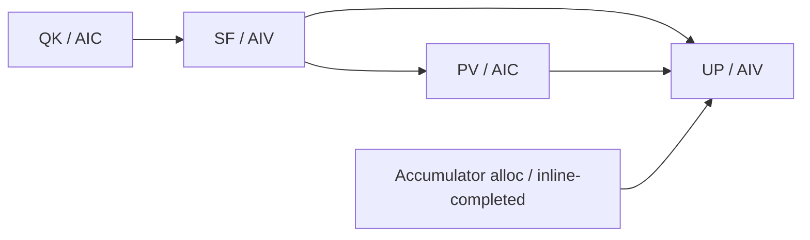

# A5 HBG Completion Inbox：Paged Attention Unroll Case1 性能与泳道分析

## 结论

`feat/hbg-completion-inbox` 的干净 HEAD `401f954c` 在 A5
`TestPagedAttentionUnrollHostBuildGraphA5::Case1` 上 20/20 轮成功：

- 全 20 轮 `device_wall` 为 **1.355 ± 0.041 ms**，P50 **1.350 ms**，
  P95 **1.390 ms**；
- 去掉每个新进程内明显偏高的首轮后，19 轮稳态为
  **1.347 ± 0.019 ms**，P95 **1.376 ms**；
- Level-1 泳道包含全部 **1,024 个 Kernel task**、**84 个 AICore worker**
  和 **1,024 条可渲染依赖 flow**；AICore 观测跨度为 **1.136 ms**；
- 四个指定阶段中，`TicketClaim` 的累计 core-time 和尾部最大；
  `CompletionEnqueue` 已稳定在亚微秒级，不再是主瓶颈。

当前工作目录还包含未提交的 staged/unstaged 改动，且这些改动因
`runtime_maker.cpp` 与 sidecar 字段不一致而无法编译。本报告没有修改或测量该未完成状态，
而是在独立 worktree 中构建并测量分支的干净提交 `401f954c`。

## 测试对象与方法

| Item | Value |
| ---- | ----- |
| 分支 / 提交 | `feat/hbg-completion-inbox` / `401f954cb75e5293ef5db9428d2fbfede25dee22` |
| PTO-ISA pin | `83d01313d9bfc247c4b7c8bcf969d1019f0d106f` |
| 用例 | `TestPagedAttentionUnrollHostBuildGraphA5::Case1` |
| Case 参数 | batch 256、16 heads、1 KV head、head dim 128、block size 128、context 8192、BF16 |
| 设备 | `task-submit` 独占 device 0；运行日志识别为 `Ascend950PR_9579` |
| 架构预检 | 用户授权 `a5 --force`；保留设备独占锁 |
| 性能协议 | 独立预热进程 1 轮；新进程 20 轮；profiling 关闭；`--skip-golden` |
| DFX 协议 | dep-gen 与 Level-1 chip-swimlane 分开运行，避免 dep-gen 扰动泳道 |

核心命令为：

```bash
python tests/st/a5/host_build_graph/paged_attention_unroll/test_paged_attention_unroll.py \
  -p a5 -d "$TASK_DEVICE" --case Case1 --rounds 20 --skip-golden

python tests/st/a5/host_build_graph/paged_attention_unroll/test_paged_attention_unroll.py \
  -p a5 -d "$TASK_DEVICE" --case Case1 --enable-dep-gen --skip-golden

python tests/st/a5/host_build_graph/paged_attention_unroll/test_paged_attention_unroll.py \
  -p a5 -d "$TASK_DEVICE" --case Case1 --enable-chip-swimlane 1 --skip-golden
```

## 性能结果

单位为 ms，`±` 后为样本标准差。95% CI 使用 t 分布。

| Sample | Count | Mean ± sd | Minimum | Median | P95 latency | Maximum | Mean 95% CI |
| ------ | ----: | --------: | ------: | -----: | ----------: | ------: | ----------: |
| 全部 | 20 | **1.355 ± 0.041** | 1.319 | 1.350 | 1.390 | 1.512 | [1.336, 1.374] |
| 稳态（去首轮） | 19 | **1.347 ± 0.019** | 1.319 | 1.348 | 1.376 | 1.384 | [1.338, 1.356] |

20 个 `device_wall` 原始样本为：

```text
1.511950, 1.327892, 1.362410, 1.354900, 1.374624,
1.355250, 1.356435, 1.321034, 1.323331, 1.319349,
1.343622, 1.339006, 1.351865, 1.368635, 1.347791,
1.383698, 1.353849, 1.333708, 1.346684, 1.321654 ms
```

Host 全流程为 **194.061 ± 7.800 ms**，主要由每轮 graph bind 构成，不适合判断
AICore scheduler 性能。HBG 当前没有 Effective/Orch/Sched 分项 marker，因此本报告以
`simpler_run.runner_run.device_wall` 为端到端设备指标。

本次全样本均值与该分支历史优化后数据 1.364 ms 相差约 -0.64%，处于 ±2% 噪声区间。
相对缓存 resolver 数量前的历史同卡结果 1.706 ms，当前约低 20.6%；该比较跨采集时段，
用于验证优化方向，不替代同批次 A/B。

## Case1 任务拓扑

Case1 的 context 恰好为 64 个 KV block，等于 unroll 宽度，因此每个 batch 只产生一组
QK/SF/PV/UP。256 个 batch 共生成 1,024 个可执行 Kernel task，四类各 256 个；另有
256 个 host-built allocator task 在运行前 inline-complete。



dep-gen 共导出 1,280 条 tensor edge。Perfetto 对有 AICore anchor 的可执行任务渲染
1,024 条 flow；allocator 到 UP 的 256 条边没有 AICore task bar，因此不渲染 flow。

## 泳道摘要

Level-1 capture 的 `device_wall` 为 1.743 ms，profiling 收集使它比稳态无 profiling
均值高约 29%。以下 phase 数值适合定位相对热点，不能替代无 profiling 的端到端性能。

| Kernel | Count | Avg exec |
| ------ | ----: | -------: |
| QK | 256 | 61.28 us |
| SF | 256 | 60.99 us |
| PV | 256 | 43.17 us |
| UP | 256 | 3.18 us |
| 合计 | 1,024 | 43.166 ms core-time |

| Phase | Count | Core-time sum | Average | Median | P95 latency | Maximum |
| ----- | ----: | ------------: | ------: | -----: | ----------: | ------: |
| `CompletionEnqueue` | 1,024 | 586.758 us | **0.573 us** | 0.481 us | 1.160 us | 4.225 us |
| `TicketClaim` | 940 | 1,111.376 us | **1.182 us** | 0.596 us | 3.445 us | 14.003 us |
| `TaskInitialize` | 551 | 483.652 us | **0.878 us** | 0.801 us | 1.694 us | 2.549 us |
| `Payload` | 1,024 | 381.125 us | **0.372 us** | 0.041 us | 1.521 us | 5.490 us |

累计 core-time 跨 84 个 worker 并行重叠，不能直接相加或除以 `device_wall`。同一 worker
相邻两个 Kernel 的间隙共 940 个，均值 40.38 us、P50 6.36 us、P95 162.95 us、最大
210.59 us。长尾主要对应任务仍在等待依赖、worker 先推进其他 pending task，或 resolver
尚未把 READY payload 发布回来；它不是上述四个主动 phase 的简单求和。

`TaskInitialize` 只有 551 条是泳道切分规则导致的：只有 claim 确实发生在同一 worker
两个相邻 Kernel 之间时，才能独立切为 `TaskInitialize`/`TaskRoute`。其余 ticket task
已更早进入第二个 pending slot，相关间隔表现为 `InterTaskSchedule` 或与 `PendingWait`
重叠，并不表示初始化缺失。84 个 seed task 使用 `SeedClaim`，所以后续
`TicketClaim` 数量为 1,024 - 84 = 940。

## 两个 Kernel 之间的执行流程

同一个 AICore worker 上，从 Kernel A 返回到 Kernel B 启动，正常流程如下：

```text
Kernel A
  → CompletionEnqueue(A)
  → PostCompletion
  → [AIV 每 4 个完成任务可执行一次 CompletionService]
  → TraceCommit（仅 Level-1 profiling）
  → 若有空 pending slot：TicketClaim(B) → TaskInitialize(B) → TaskRoute(B)
    否则：继续处理已经 claim 的 pending task
  → ReadyScan(B)
  → [BLOCKED 时等待 completion resolver 推进依赖；期间可执行其他 pending task]
  → Payload(B)
  → Kernel B
```

跨 worker 的依赖推进与上述 owner 路径并行：

```text
producer Kernel 结束
  → producer 将 completion 压入某个 AIV resolver inbox
  → AIV resolver 批量摘取 inbox
  → WakeResolve 关闭 producer wake-list，并重新路由 waiter
  → 最后一个 fanin 完成时，由 resolver 在 waiter owner 的私有 slot 中构造 payload
  → resolver 发布 8 条 payload cache line，再发布 READY
  → owner 的 ReadyScan 观察到 READY，刷新 payload 后执行 Kernel
```

## 四个阶段的主要工作与耗时原因

### `CompletionEnqueue`

主要工作：

1. 将当前 task control 状态写成 `DONE`；
2. 使用缓存的 AIV resolver 数量计算 `task_id % resolver_count`；
3. 对目标 inbox head 执行一次 GM `atomicExch`，得到旧 head；
4. 把旧 head 写入本 task 的 intrusive `completion_next`；
5. 用 `dcci + dsb` 发布 task-control cache line。

当前均值只有 0.573 us。剩余成本主要来自 GM 原子交换、多个 producer 偶发命中同一
inbox 的竞争，以及 cache-line clean 后的 `dsb` 等待。分支已经把只读
`aiv_active_worker_count` 在 worker startup 时快照一次；否则 A5 的 64-bit GM load 会以
`atomicAdd(addr, 0)` 实现，84 个 worker 会竞争同一地址，历史上曾把本阶段拉到约 22 us。

### `TicketClaim`

主要工作：

1. 对对应 core type 的 typed-stream `next_index` 做一次 GM `atomicAdd(1)`；
2. 检查是否越过 task count；
3. 从只读 ticket stream 读取一个 8-byte ticket。ticket 已包含 host 验证过的 task id、
   kernel id、subtask slot 和 `has_fanin`。

它是四个阶段中当前最大的主动热点：均值 1.182 us，P95 3.445 us。原因是 28 个 AIC
worker 共享一个 AIC cursor，56 个 AIV worker 共享另一个 AIV cursor，原子加在每条 stream
上串行化。AIV 的 SF ticket 尾部最明显：本次均值 2.098 us、P95 10.241 us。
8-byte ticket 已降低后续 GM 读取量，但不能消除 cursor 原子竞争。

### `TaskInitialize`

主要工作不只是复制 ticket：

1. 把 ticket 字段复制到 owner-private 的 64-byte pending slot；
2. 若该双缓冲 payload slot 被用过，clean 其 8 条 cache line，避免 owner 的旧 cache
   覆盖 resolver 之后的远端 materialization；
3. 构造 callable、owner、pending slot、kernel 等 claim binding；
4. 对有 fanin 的任务把 64-byte binding 发布到 GM，供 resolver 在 READY 时定位 owner
   payload slot。

pending slot 的本地赋值很便宜；均值 0.878 us 主要来自复用 payload 的 cache maintenance，
以及 fanin task 的 binding 写入、`dcci` 和 `dsb`。不同 task 是否有 fanin、slot 是否首次使用，
形成了分布差异。

### `Payload`

它把 host-built graph 中的 task 转为 Kernel 可直接消费的 512-byte
`PTO2DispatchPayload`：解析 callable，填充 tensor/scalar args 和本地 context。

- 无 fanin 的 root task 由 owner 本地 materialize；QK 本次均值 1.079 us，是主要成本来源；
- 有 fanin 的任务通常已由 AIV resolver 在 owner 的私有 slot 中 materialize 并发布，owner
  观察到 READY 后刷新 8 条 payload cache line；PV 本次均值仅 0.012 us，UP 为 0.042 us；
- SF 同时受到 payload 发布时序和 cache 状态影响，本次均值 0.355 us。

因此总体 P50 只有 0.041 us，而 P95 为 1.521 us：这是 root 本地构造、远端已构造 payload
的刷新路径和 cache 冷热状态混合形成的双峰分布，不是单一固定成本。

## 判断与后续优化优先级

1. Completion inbox 的 producer 热点已经关闭；`CompletionEnqueue` 不应作为下一优先级。
2. 若继续压缩 scheduler 主动开销，优先检查 typed-stream cursor 的 `TicketClaim` 竞争和
   SF/AIV 长尾，但需要在 profiling-off A/B 中确认端到端收益。
3. P95 约 163 us 的同 worker inter-kernel gap 主要包含 dependency wait 和 pending-slot
   调度，不应误归因到四个亚微秒/微秒级 phase。要继续定位长尾，需要保持当前 Level-1
   task trace，按依赖链对 READY 发布到 Kernel start 的 lag 分桶。
4. A5 HBG 当前只支持 chip-swimlane Level 1，不能使用要求 Level >= 3 的通用
   `sched_overhead_analysis`；这里也没有 AICPU steady-state dispatch，调度发生在 AICore。

## 产物

- 性能原始日志：
  `outputs/A5_HBG_COMPLETION_INBOX_CASE1_401f954c_20260814/perf_rounds20.log`
- Level-1 原始记录：
  `outputs/A5_HBG_COMPLETION_INBOX_CASE1_401f954c_20260814/chip_swimlane_records.json`
- dep-gen 依赖图：
  `outputs/A5_HBG_COMPLETION_INBOX_CASE1_401f954c_20260814/deps.json`
- Perfetto 泳道（已合并依赖箭头）：
  `outputs/A5_HBG_COMPLETION_INBOX_CASE1_401f954c_20260814/merged_swimlane_with_deps.json`
- profile 日志：
  `outputs/A5_HBG_COMPLETION_INBOX_CASE1_401f954c_20260814/profile_l1.log`

将 `merged_swimlane_with_deps.json` 拖入 Perfetto UI 即可查看 84 个 worker lane、1,024 个
Kernel、scheduler phases 和 1,024 条 dependency flow。
