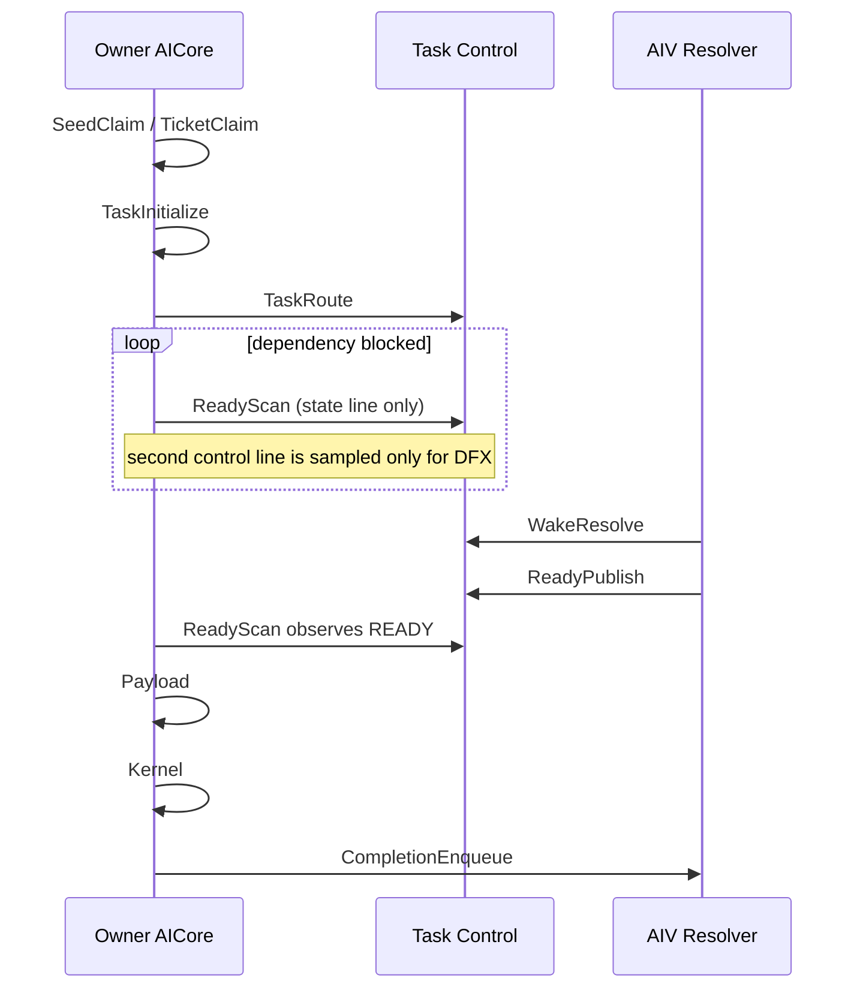

# A5 HBG Paged Attention Unroll Case1：优化 1/3 性能报告

## 结论

优化 1/3 没有带来可确认的 Case1 端到端性能收益。去掉每个独立进程的首轮冷启动样本后，当前工作树的 Device wall 为 **1.352 ± 0.015 ms**，修改前 HEAD 为 **1.344 ± 0.021 ms**，当前高 **0.008 ms / 0.609%**。差异落在既定的 ±2% 噪声区间内，应判定为性能持平，而不是回退或提升。

level-1 scheduler trace 显示 8-byte ticket 确实降低了 `TicketClaim` 的尾部成本：940 次 claim 的累计 core-time 从 **1,047.019 us** 降到 **907.493 us**（**-13.33%**），p95 从 **4.861 us** 降到 **3.502 us**（**-27.96%**）。但 `TicketClaim` 只占约 0.9 ms 的并行累计 core-time，对约 1.35 ms 的设备墙钟影响很小；同时 kernel span 与 PendingWait 的运行波动足以覆盖该收益。

## 测试对象与条件

- 当前版本：HEAD `401f954c` 加未提交的优化 1/3。
- 对照版本：独立临时 worktree 中的干净 HEAD `401f954c`。
- 优化 1：BLOCKED 热轮询不再每轮 invalidate 第二条 task-control cache line。
- 优化 3：ticket 从 16 byte 缩至 8 byte，只缓存 `has_fanin`，不缓存完整 fanin count。
- Case：`TestPagedAttentionUnrollHostBuildGraphA5::Case1`。
- 参数：batch 256、16 heads、1 KV head、head dimension 128、block size 128、context length 8192、max model length 32768、BF16。
- 硬件：A5 device 0；runtime fallback 识别为 `Ascend950PR_9579`。
- 隔离：全部板载运行通过 `task-submit` 独占 device 0。
- 预检：按用户明确授权使用 `--force`；`npu-smi` board query 未返回芯片字段。
- Golden：性能与 profiling 运行均使用 `--skip-golden`；修改后的 Case1 正确性已在前序板载测试通过。

## Profiling-off 性能

测试采用 ABBA 顺序：当前 10 轮、基线 10 轮、基线 10 轮、当前 10 轮。两个版本各 20/20 轮成功。

### 全部样本

单位为 ms，`±` 后为样本标准差。

| 指标 | 修改前 HEAD | 当前优化 1/3 | 差值 | 变化 |
| ---- | ----------: | -----------: | ---: | ---: |
| Device mean ± sd | 1.356 ± 0.043 | 1.366 ± 0.047 | +0.010 | +0.742% |
| Device p50 | 1.342 | 1.355 | +0.013 | +0.979% |
| Device p95 | 1.458 | 1.471 | +0.013 | +0.879% |
| Device min | 1.303 | 1.333 | +0.031 | — |
| Device max | 1.479 | 1.522 | +0.043 | — |
| Host mean ± sd | 169.118 ± 10.396 | 165.806 ± 18.142 | -3.313 | -1.959% |

Host 时间主要由每轮 graph bind 和主机调度构成，不用于判断 AICore scheduler 优化效果。

### 稳态样本

每个独立进程的第一轮均比后续轮次慢约 0.1–0.2 ms。按版本分别丢弃两个 block 的首轮后，每个版本保留 18 个稳态样本：

| 指标 | 修改前 HEAD | 当前优化 1/3 | 差值 | 变化 |
| ---- | ----------: | -----------: | ---: | ---: |
| Device mean ± sd | **1.344 ± 0.021** | 1.352 ± 0.015 | +0.008 | **+0.609%** |
| Device p50 | **1.340** | 1.353 | +0.013 | +0.971% |
| Device p95 | 1.374 | **1.371** | -0.003 | -0.208% |
| Device min | **1.303** | 1.333 | +0.031 | — |
| Device max | 1.395 | **1.392** | -0.003 | — |

均值与 p50 略慢、p95 略快，方向不一致，且变化均低于 1%。因此本轮不能证明优化 1/3 改善或损害端到端性能。

## Scheduler trace 对比

当前和基线分别采集一次 `--enable-chip-swimlane 1`。该 profile level 是 A5 HBG 当前唯一支持的非零等级；level 4 会在执行前被参数校验拒绝。

两份 trace 都包含 1,024 个 `Kernel`、`Payload` 和 `ReadyScan` 阶段，任务覆盖完整。当前 trace 包含 14,271 个 scheduler phase，覆盖 84 个 worker。

| Phase | 次数 | 修改前平均 | 当前平均 | 变化 | 修改前 p95 | 当前 p95 |
| ----- | ---: | ---------: | -------: | ---: | ---------: | -------: |
| SeedClaim | 84 | 0.159 us | 0.151 us | -5.02% | 0.346 us | 0.334 us |
| TicketClaim | 940 | 1.114 us | **0.965 us** | **-13.33%** | 4.861 us | **3.502 us** |
| TaskInitialize | 581 / 568 | 0.843 us | 0.871 us | +3.27% | 1.476 us | 1.649 us |
| TaskRoute | 581 / 568 | 1.501 us | 1.481 us | -1.29% | 3.646 us | 3.759 us |
| ReadyScan | 1,024 | 0.247 us | 0.244 us | -1.02% | 0.403 us | 0.401 us |
| Payload | 1,024 | 0.385 us | 0.381 us | -0.94% | 1.532 us | 1.542 us |
| CompletionEnqueue | 1,024 | 0.583 us | 0.600 us | +2.96% | 1.240 us | 1.273 us |
| WakeResolve | 1,024 | 3.125 us | 3.188 us | +2.01% | 6.619 us | 6.937 us |

`TaskInitialize`/`TaskRoute` 次数差异来自任务在 seed 与 ticket claim 之间的所有权分布变化；两份 trace 的总任务数均为 1,024。

并行累计时间与墙钟跨度如下：

| 指标 | 修改前 HEAD | 当前优化 1/3 | 变化 |
| ---- | ----------: | -----------: | ---: |
| TicketClaim 累计 core-time | 1,047.019 us | **907.493 us** | **-13.33%** |
| ReadyScan 累计 core-time | 252.518 us | **249.931 us** | -1.02% |
| PendingWait 累计 core-time | **86.362 ms** | 87.089 ms | +0.84% |
| Kernel 累计 core-time | 43.426 ms | 43.460 ms | +0.08% |
| Kernel observed span | **1.135 ms** | 1.138 ms | +0.30% |
| Profiled Device wall | 1.727 ms | **1.708 ms** | -1.06% |

PendingWait 和 Kernel 累计时间跨 84 个 worker 并行重叠，不能和 Device wall 相加。单次 profiling 样本的 Device wall 仅用于确认 trace 量级，不替代 20 轮 profiling-off 结果。

## 当前泳道摘要

当前 trace 中四类 kernel 各 256 个：

| Kernel | 数量 | 平均执行时间 |
| ------ | ---: | -----------: |
| QK | 256 | 61.96 us |
| SF | 256 | 61.44 us |
| PV | 256 | 43.17 us |
| UP | 256 | 3.21 us |

执行与解依赖关系可概括为：

## 产物

- 当前性能原始日志：`outputs/opt13_case1_20260814_103542/current.log`、`current_b.log`。
- 基线性能原始日志：`outputs/opt13_case1_20260814_103542/baseline.log`、`baseline_b.log`。
- 当前 profile 日志：`outputs/opt13_case1_20260814_103542/profile_l1.log`。
- 当前原始泳道：`outputs/TestPagedAttentionUnrollHostBuildGraphA5_Case1_20260814_103748/chip_swimlane_records.json`。
- 当前 Perfetto 泳道：`outputs/TestPagedAttentionUnrollHostBuildGraphA5_Case1_20260814_103748/merged_swimlane.json`。
- 当前依赖图：`outputs/TestPagedAttentionUnrollHostBuildGraphA5_Case1_20260814_103748/deps.json`。
- 基线 Perfetto 泳道：`outputs/TestPagedAttentionUnrollHostBuildGraphA5_Case1_20260814_103932/merged_swimlane.json`。

将 `merged_swimlane.json` 拖入 Perfetto UI 即可查看全部 84 个 worker、scheduler phase、kernel 和依赖箭头。当前 trace 的 collector 对每核初始 buffer 的空尾槽打印了告警，但 converter 从独立的 `aicore_scheduler_phases` 完整恢复了 1,024 个唯一 Kernel task；未发现 scheduler phase 缺失。
