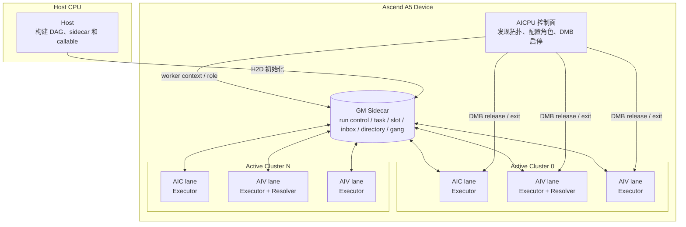
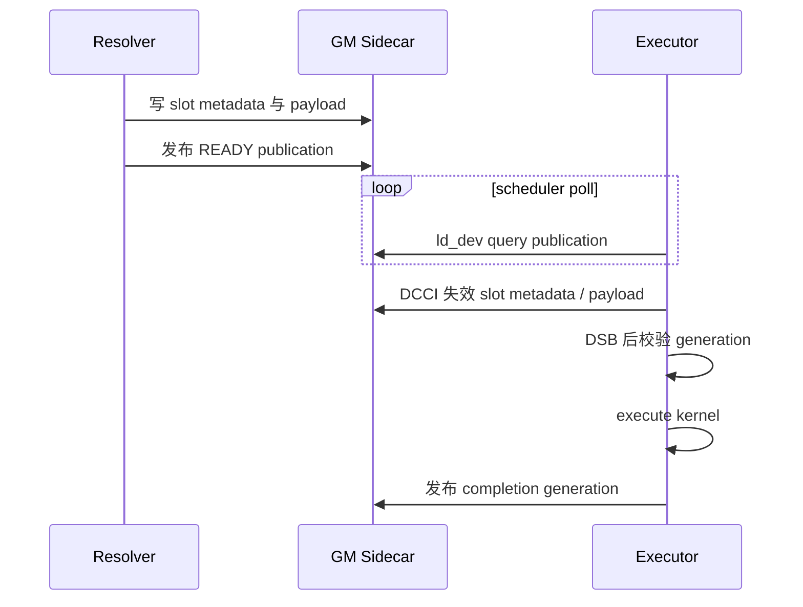
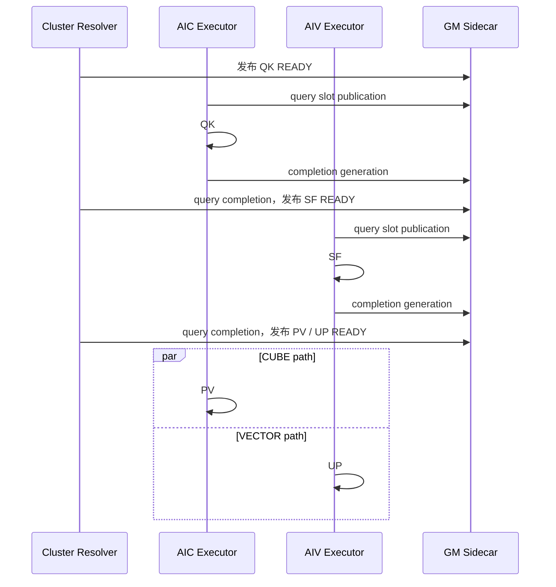

# A5 HBG AICore GM Query 方案

本文介绍 A5 `host_build_graph`（HBG）AICore 调度器的只读 GM 查询方案。
方案为观察类访问提供 `aicore_gm_query_v0`，在 A5 AICore 上通过
`ld_dev` 绕过 Scalar DCache 读取 GM；真正改变共享状态或取得所有权的路径继续使用
CAS、exchange、fetch 和 store。设计覆盖 Executor、Ready Scheduler 和 Gang
Scheduler，代码基线为提交 `45cd3a17`。

## 1. 方案背景与核心思路

HBG 的稳态调度运行在 AICore 上。Executor 持续观察自己的 dispatch slot，Resolver
持续观察 task state、Ready/Completion inbox、Ready directory、free-slot bitmap 和
Gang 状态。这些字段大多只用于判断“当前是否值得进入下一步”，不会在读取时改变协议
状态。

原实现用原子 RMW 模拟 GM load：

- `int64_t` 使用 `atomicMax(address, INT64_MIN)`；
- `uint64_t` 使用 `atomicAdd(address, 0)`。

identity 操作虽然不改变数值，仍会进入原子更新路径。多个 Executor/Resolver 反复查询
共享字段时，只读流量也会争用原子单元和 GM cache line，尤其集中在 scheduler loop、
Ready directory 扫描和 slot publication 轮询上。

本方案把共享 GM 访问分成两类：

| 访问类型 | 目的 | 使用的 primitive |
| -------- | ---- | ---------------- |
| 观察 / 预筛选 | 判断状态、发现候选、决定是否进入慢路径 | `aicore_gm_query_v0` |
| 发布 / 取得所有权 | 改变状态、摘取链表、占用 slot、更新 bitmap | CAS、exchange、fetch、store |

核心原则是：**query 只回答“现在看到了什么”，不承担状态转换的线性化点。** 如果观察
结果需要进一步取得共享对象，后续仍必须由原协议中的 CAS、exchange 或单 owner store
完成。

## 2. 方案总体架构

### 2.1 角色及职责

该方案不增加新的线程、kernel 或设备角色，而是优化现有角色访问 GM 控制字段的方式。

| 角色 | 部署位置 | 主要职责 | 与 query 的关系 |
| ---- | -------- | -------- | --------------- |
| Host | Host CPU 进程 | 构建完整 DAG、callable 和 sidecar 布局，初始化任务及调度控制区，上传设备镜像 | 不调用 AICore query；负责提供被观察的初始状态 |
| AICPU 控制面 | Device AICPU | 发现物理拓扑，选择 active cluster/worker，发布 worker context，控制 DMB 启动和退出 | 初始化 `resolver_count`、worker role 等只读配置，并在运行前 flush 到 GM |
| Executor | 每个 active AIC/AIV worker | 轮询本 worker 的两个 dispatch slot，消费 `READY` publication，执行 kernel，发布 completion | 高频查询启动标志、错误标志和 slot publication |
| Resolver | 每个 active cluster 中选定的一个 AIV worker | 初始化 Ready 状态，处理依赖、Ready/Completion、slot refill 和 Gang 协调 | 高频查询 task、inbox、directory、slot 和 cohort 状态 |
| Ready Scheduler | Resolver 内部库逻辑 | 路由普通任务、维护 Ready/Completion inbox、Ready directory 和 free-slot directory | 使用 query 做候选发现，以 CAS/exchange/fetch 完成竞争式更新 |
| Gang Scheduler | Resolver 内部库逻辑 | 为 MIX/SPMD task 协调 cluster 内 AIC/AIV slot、cohort generation 和同步启动 | 使用 query 扫描 cluster 状态，由 cluster Resolver 执行后续发布 |
| GM Sidecar | Device Global Memory | 保存 run control、worker context、task control、dispatch slot、inbox、directory 和 Gang 控制结构 | query、原子更新和显式 cache 操作共同访问的协议载体 |

Ready Scheduler 和 Gang Scheduler 不是独立部署实体。它们是 Resolver 在统一
`run_ready_dispatch_loop` 中调用的两组调度逻辑；Executor 和 Resolver 也不是两个独立
kernel，Resolver 所在的 AIV worker 同时承担 Executor 职责。

### 2.2 当前部署方式

A5 一个物理 cluster 包含一个 AIC lane 和两个 AIV lane。AICPU 根据图中的 AIC/AIV
worker demand 选择 active cluster；若图包含 Gang task，则启用全部 cluster。每个 active
cluster 从两个 AIV lane 中选择物理 core ID 较小者作为 Resolver。



每个 active worker 都有两个固定 dispatch slot。普通任务可由任意 Resolver 从对应核型的
Ready inbox 领取，再绑定到一个 free slot；Gang task 由所属 cluster 的 Resolver 同时
准备该 cluster 的参与 lane。Executor 只执行已经发布到自身 slot 的任务，不遍历全局
DAG。

### 2.3 角色协作关系

稳态循环中的协作顺序如下：

```text
Host/AICPU 初始化 GM 与角色
  -> Resolver 建立初始 Ready 状态并填充 slot
  -> Executor query slot publication
  -> READY 命中后显式失效 slot/payload cache，执行 kernel
  -> Executor 发布 completion generation
  -> cluster Resolver query completion，解析依赖并释放 slot
  -> Ready Scheduler 或 Gang Scheduler 准备下一批 slot
```

Resolver 优先服务本 cluster 的 completion 和 Gang 状态，然后为 cluster 内普通 Executor
补充任务；同一个 AIV worker 随后仍会扫描并执行自己的 AIV slot。AICPU 不参与稳态的
逐任务调度。

## 3. GM 查询机制视角

### 3.1 A5 查询实现

`aicore_gm_query_v0` 为 signed/unsigned 64-bit GM 字段提供统一接口：

```cpp
inline __aicore__ int64_t aicore_gm_query_v0(
    __gm__ volatile int64_t &value,
    int order = __ATOMIC_ACQUIRE
) {
#if defined(__CCE_AICORE__)
    (void)order;
    __gm__ int64_t *signed_address = const_cast<__gm__ int64_t *>(&value);
    __gm__ uint64_t *address =
        reinterpret_cast<__gm__ uint64_t *>(signed_address);
    return static_cast<int64_t>(
        static_cast<uint64_t>(__builtin_cce_ld_dev(address, 0))
    );
#else
    return __atomic_load_n(&value, order);
#endif
}
```

A5 AICore 路径使用 `ld_dev` 直接观察 GM，避免普通 scalar load 命中旧 DCache line，也
避免通过 `atomicAdd(0)` 或 `atomicMax(identity)` 进入 RMW 路径。signed 版本只在地址
访问层转换为 `uint64_t`，返回时保留原始 bit pattern。Host 和 simulation 路径继续使用
`__atomic_load_n`，使 C++ UT 保留 acquire-load 语义。

### 3.2 Query、publication 与元数据读取

query 适合独立控制字，例如 task state、inbox head、directory bitmap 和 slot
publication。对于“publication 控制另一段元数据”的结构，query 只读取 publication；
命中目标状态后，消费者仍显式失效元数据 cache line 并执行 barrier。

`AicoreDispatchSlotV1` 将 Resolver-owned metadata 和 Executor 高频轮询的 publication
放在不同 cache line：

```text
cache line 0: task_id / kernel_id / generation / owner metadata
cache line 1: publication
```

Executor 的消费顺序为：



因此 query 不替代 publication protocol，也不承担 payload 的 cache 可见性；它只降低
publication 观察本身的成本。

### 3.3 Query 与原子更新的边界

各 primitive 的职责保持清晰分离：

| Primitive | A5 实现 | 协议职责 |
| --------- | ------- | -------- |
| `aicore_gm_query_v0` | `ld_dev` | 观察当前值、预筛选候选 |
| `aicore_gm_store_v0` | `st_dev` + store barrier | 单 owner 状态发布 |
| `aicore_gm_publish_v0` | `atomicExch` | 需要原子 publication 的发布 |
| `aicore_gm_exchange_v0` | `atomicExch` | 摘取 inbox/link 并取得所有权 |
| `aicore_gm_compare_exchange_v0` | `atomicCAS` | 多参与者竞争式状态转换 |
| `aicore_gm_fetch_add_v0` | `atomicAdd` | 计数器的原子递增 |
| `aicore_gm_fetch_or/and_v0` | query + CAS loop | bitmap 的原子置位/清位 |

`fetch_or` 和 `fetch_and` 先用 query 获取 CAS expected 值。若目标位已经满足，函数可直接
返回；否则真正的更新仍由 CAS 完成，CAS 返回的 actual 值驱动下一轮重试。query 不改变
bitmap 的线性化点。

```text
observed = query(bitmap)
while desired bits 尚未满足:
    actual = CAS(bitmap, observed, desired(observed))
    CAS 成功 -> 更新完成
    CAS 失败 -> observed = actual，继续重试
```

## 4. Executor 视角：轮询与任务执行

### 4.1 Executor 主循环

每个 active AIC/AIV worker 都执行统一的 Executor loop，并独占两个 dispatch slot。
Resolver worker 会先执行 Resolver 分支，再扫描自己的 slot；其他 worker 直接扫描 slot。

```text
读取静态 resolver_count
  -> 轮询退出信号和 scheduler_error
  -> Resolver worker 推进 completion / Gang / normal refill
  -> 轮转 query 两个 slot publication
  -> 未命中 READY：继续循环或 backoff
  -> 命中 READY：失效 metadata/payload cache
  -> 校验 task、slot、generation
  -> 执行 kernel
  -> 发布 completion generation
```

### 4.2 Executor 查询点

| 查询对象 | 所在路径 | 查询用途 | 后续动作 |
| -------- | -------- | -------- | -------- |
| bootstrap completion flag | Resolver bootstrap barrier | 等待所有 Resolver 完成初始扫描或首波准备 | 只控制启动阶段前进，不取得对象所有权 |
| `run_control.scheduler_error` | bootstrap wait、稳态稀疏轮询 | 尽快退出已失败调度 | 返回错误路径 |
| `run_control.resolver_count` | bootstrap 和 loop 初始化 | 快照 Resolver/cluster 数量 | 初始化 victim cursor 和路由参数 |
| `context.bootstrap_done` | 非 Resolver worker 启动门 | 等待所属 Resolver 准备本 worker slot | 命中后进入 slot 扫描 |
| `slot.publication` | 每轮两个 slot 扫描 | 找到未消费的 `READY` generation | DCCI metadata/payload 后执行 kernel |

当前工作树的启动流程将 bootstrap 拆成 scan/prepare 子阶段时，上表中的具体 flag 会对应
`bootstrap_scan_complete` 或同类阶段标志；访问性质仍是多 worker 观察单 writer 发布，
不需要用 RMW 模拟 load。

### 4.3 高频路径的变化

Executor 最热的 query 是 `slot.publication`。每个 worker 在每轮 loop 中最多观察两个
slot；未命中时不写 GM。旧方案即使 slot 没变化也会执行 atomic RMW，新方案只发出
`ld_dev` 读取。命中 `READY` 后才进入 metadata DCCI、generation 校验和 kernel 路径，
因此优化不会扩大慢路径的工作范围。

## 5. Ready Scheduler 视角：普通任务调度

Ready Scheduler 处理普通 AIC/AIV task 的依赖路由、Ready inbox、Ready directory、
free-slot directory 和 Completion inbox。query 主要用于两种位置：扫描候选，以及进入
CAS/exchange 前获取 expected 值。

### 5.1 Task 与 wake-list 查询

| 调用位置 | 查询字段 | 作用 | 状态转换方式 |
| -------- | -------- | ---- | ------------ |
| `aicore_route_task_v1` | `control.state` | 校验 task 当前是 `BLOCKED/READY/DONE` | 路由函数按协议发布后续状态 |
| `aicore_route_task_v1` | `producer_control.state` | 跳过已经完成的 fanin | 只观察 producer |
| `aicore_route_task_v1` | `producer_control.wake_list_head` | 获取 waiter push 的 CAS expected | CAS 注册 waiter；`CLOSED` 表示直接继续 |

Task state 的 query 决定是否继续路由；wake-list head 的 query 只提供初始 observed 值。
并发 close/push 的先后仍由 CAS/closed-state 协议决定。

### 5.2 Ready inbox 与 Ready directory 查询

| 调用位置 | 查询字段 | 作用 | 后续所有权动作 |
| -------- | -------- | ---- | -------------- |
| `aicore_ready_owner_maintain_type_v1` | `inbox.head` | owner 判断是否提升本地 pending bank 或清 directory bit | 普通 store 发布 pending head；两 bank 为空时清 bit |
| `aicore_ready_batch_push_v1` | `inbox.head` | owner 判断 batch 直接发布还是追加到本地 pending bank | 空 out 以普通 store 发布，否则只更新 owner-local FIFO |
| `aicore_ready_pop_from_inbox_v1` | `inbox.head` | 发现可弹出的 ready task | CAS/exchange 更新 head |
| `aicore_ready_pop_from_inbox_v1` link wait | `inbox.head` | 等待 next link 发布时判断 head 是否已变化 | 变化后重新开始领取 |
| `aicore_load_ready_directory_shard_v1` | shard bitmap | 发现本 shard 中非空 inbox | 进入具体 inbox claim |

directory bit 是提示信息，不是 Ready task 的所有权。consumer 不再清 bit；Resolver owner
在 published out 与本地 pending 同时为空时清除它。真正的 task 领取仍发生在 inbox head
的 CAS 更新处。

### 5.3 Free-slot directory 查询

| 调用位置 | 查询字段 | 作用 | 后续所有权动作 |
| -------- | -------- | ---- | -------------- |
| `aicore_load_free_slot_directory_masks_v1` | bitmap word | 批量快照候选 free slot | 只生成本地 masks |
| `aicore_try_claim_free_slot_from_masks_v1` | bitmap word | 在 CAS 前重新确认候选 bit | CAS 清 bit |
| `aicore_try_claim_free_slot_from_masks_v1` | `slot.publication` | 校验物理 slot 仍为 `FREE` | CAS 将 publication 改为 `FILLING` |

这里存在两级所有权：directory bit 先把候选缩小到一个物理 slot，slot publication CAS
再确认 generation 和 `FREE -> FILLING`。两级观察都可使用 query，两级状态转换均保留
CAS。

### 5.4 Completion 查询

| 调用位置 | 查询字段 | 作用 | 后续所有权动作 |
| -------- | -------- | ---- | -------------- |
| `aicore_release_completed_slot_v1` | `slot.publication` | 校验 task/generation 仍对应当前 `READY` slot | 单 owner 释放 slot 并重新 advertise |
| `aicore_enqueue_completion_v1` | `inbox.head` | 获取 completion push 的初始链头 | CAS/exchange 发布 completion |
| `aicore_resolve_completion_v1` | `control.state` | 校验 kernel 已发布 `DONE` | Resolver 关闭 wake list、推进 consumer |
| `aicore_service_completion_inboxes_v1` | local `inbox.head` | 避免对空 inbox 执行 exchange | 非空时 exchange 摘链 |
| `aicore_service_completion_inboxes_v1` | victim `inbox.head` | steal 前预筛选 victim inbox | 非空时 exchange 摘链 |

local/victim inbox 的 query 是明确的 prefilter：空值直接返回，非空值只表示“值得尝试”，
最终由 exchange 决定本次 Resolver 是否真正取得链表。

## 6. Gang Scheduler 视角：Cluster 协同调度

Gang Scheduler 面向 MIX/SPMD task。一个 cluster Resolver 同时协调本 cluster 的一个
AIC lane 和两个 AIV lane；同一个 gang generation 的参与 slot 必须共同准备和释放。

### 6.1 Slot 准备与 cluster 状态查询

| 调用位置 | 查询字段 | 作用 | 后续动作 |
| -------- | -------- | ---- | -------- |
| `aicore_gang_find_free_pending_slot_v1` | `slot.publication` | 找单 worker 的 free pending slot | cluster Resolver 进入 fill 路径 |
| `aicore_gang_fill_single_v1` | `slot.publication` generation | 为新 dispatch 继承并推进 generation | 写 `FILLING` 后填充 slot |
| `aicore_gang_fill_mix_block_v1` scan | 各参与 lane 的 `slot.publication` | 寻找所有参与 lane 同时 free 的 slot index | 选中共同 pending slot |
| `aicore_gang_fill_mix_block_v1` fill | 各参与 lane 的 publication generation | 为各 lane 构造同 cohort generation | 逐 lane 写 `FILLING` 并填充 |
| `aicore_gang_local_slots_drained_v1` | `slot.publication` | 判断 cluster 是否全部归还为 `FREE` | 决定 cohort 是否可结束 |

一个 active cluster 只有一个 Resolver，因此 cluster-local slot 的准备由单 owner 串行推进；
query 用于扫描，不引入新的 owner 竞争。

### 6.2 Gang ready、release 与 completion 查询

| 调用位置 | 查询字段 | 作用 | 后续动作 |
| -------- | -------- | ---- | -------- |
| `aicore_gang_release_local_slots_v1` | `slot.publication` | 找到属于当前 cohort 的 `GATED` slot | 校验 metadata 后发布 `READY` |
| `aicore_gang_select_ready_task_v1` | `control.state` | 从优先级集合中选择真正 `READY` 的 gang task | 进入 cohort admission |
| `aicore_service_cluster_completions_v1` | `completed_generations[slot]` | 发现某 Executor 已完成的 generation | 进入 completion resolve |
| `aicore_service_cluster_completions_v1` | `slot.publication` | 交叉校验完成 generation 对应当前 slot | 解析 task 并释放 slot |
| `aicore_fill_cluster_normal_slots_v1` | `slot.publication` | 在 Gang 空档寻找普通任务 free slot | claim Ready task 并填充该 slot |

Gang 协议依靠 task state、cohort generation 和 slot publication 的组合识别同一轮协同
任务。query 只读取这些判定字段；cohort admission、slot fill、`GATED -> READY` 和
completion release 仍沿用原来的发布路径。

## 7. 性能与泳道视角

### 7.1 测试口径

性能对比使用干净的 `aab4a8f5` 作为基线，以及在该基线上只加入 GM query 修改的
`45cd3a17`。两者使用同一 A5 device 1、同一 PTO-ISA pin、相同 Case1 参数，各执行
10 轮 profiling-off `--skip-golden`；query 版本另执行独立 golden 和 Level-1 capture。

| 参数 | 值 |
| ---- | -- |
| Case | `TestPagedAttentionUnrollHostBuildGraphA5::Case1` |
| batch / heads / KV heads | 256 / 16 / 1 |
| head dimension / block size | 128 / 128 |
| context / max model length | 8192 / 32768 |
| dtype | BF16 |
| AICore task | 1024 |

### 7.2 Device wall 对比

| 版本 | 轮数 | 平均 Device wall | 最小值 | 最大值 | 相对基线 |
| ---- | ---: | ---------------: | -----: | -----: | -------: |
| 原子 RMW load 基线 | 10/10 | 1768.2 us | 1716.8 us | 1949.6 us | — |
| `ld_dev` query | 10/10 | **1495.3 us** | 1443.0 us | 1644.8 us | **-272.9 us / -15.4%** |

query 版本的独立默认 golden run 通过。性能数字来自 profiling-off 多轮运行；Level-1
泳道仅用于观察任务分布，不与上表直接混算。

### 7.3 Case1 泳道

Case1 每个 batch 形成 QK、SF、PV、UP 四类任务。下面是依赖和执行角色的简化泳道：



Level-1 trace 的任务统计为：

| Function | Count | 平均 kernel exec |
| -------- | ----: | ---------------: |
| QK | 256 | 55.69 us |
| SF | 256 | 61.90 us |
| PV | 256 | 41.13 us |
| UP | 256 | 2.43 us |
| 合计 | 1024 | 41,255.54 us core-time |

AICore 从最早 receive 到最晚 kernel end 的观测跨度为 **1339.09 us**。累计 kernel
core-time 大于墙钟跨度，反映任务在多条物理 core lane 上并行执行。Perfetto 文件包含
物理核 lane、1024 个 task bar 和由独立 dep-gen 合入的依赖箭头：

Scheduler lane 使用独立颜色突出空转开销：`InterTaskBackoff` 为红色，
`InterTaskReadyPoll` 为警示色，`InterTaskOther` 为灰色，与 kernel execution 区分。

- [Perfetto 完整泳道](swimlane/merged_swimlane_with_deps.json.gz)
- [Level-1 原始记录](swimlane/chip_swimlane_records.json.gz)
- [dep-gen 依赖图](swimlane/deps.json.gz)
- [函数名称映射](swimlane/name_map_TestPagedAttentionUnrollHostBuildGraphA5_Case1.json)
- [文件校验值](swimlane/SHA256SUMS)

查看方式：解压 `merged_swimlane_with_deps.json.gz`，在
<https://ui.perfetto.dev/> 中打开解压后的 JSON。

## 8. 方案取舍

| 方案 | GM 新鲜度 | 只读访问成本 | 状态转换能力 | 结论 |
| ---- | --------- | ------------ | ------------ | ---- |
| `atomicAdd(0)` / `atomicMax(identity)` | 直接观察 GM | 每次查询进入原子 RMW，竞争高 | 读取本身不需要该能力 | 不用于只读查询 |
| 普通 scalar load | 可能命中 Scalar DCache | 指令成本低 | 无 | 需要逐点维护 cache invalidation，不适合作为通用控制字查询 |
| `ld_dev` query | 绕过 Scalar DCache 观察 GM | 不产生 identity RMW | 无 | 用于观察和 prefilter |
| CAS / exchange / fetch / store | 按各 primitive 的发布协议访问 GM | 高于 query | 有 | 保留为所有权和状态更新路径 |

最终方案只替换“读取结果用于判断”的调用点，不改变数据结构、状态枚举、generation 编码
和线性化 primitive。其作用范围限定在 A5 HBG AICore 调度器；其他平台通过原有 Host/Sim
fallback 编译，不共享 A5 `ld_dev` 实现。
