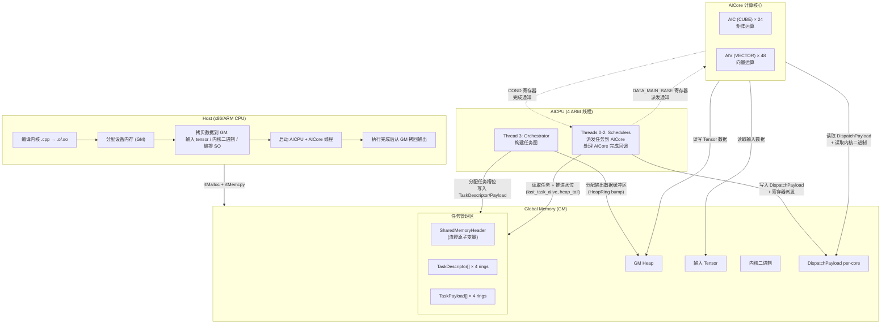
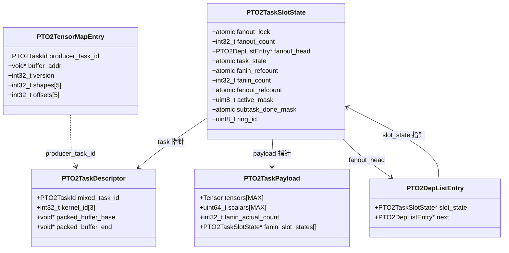
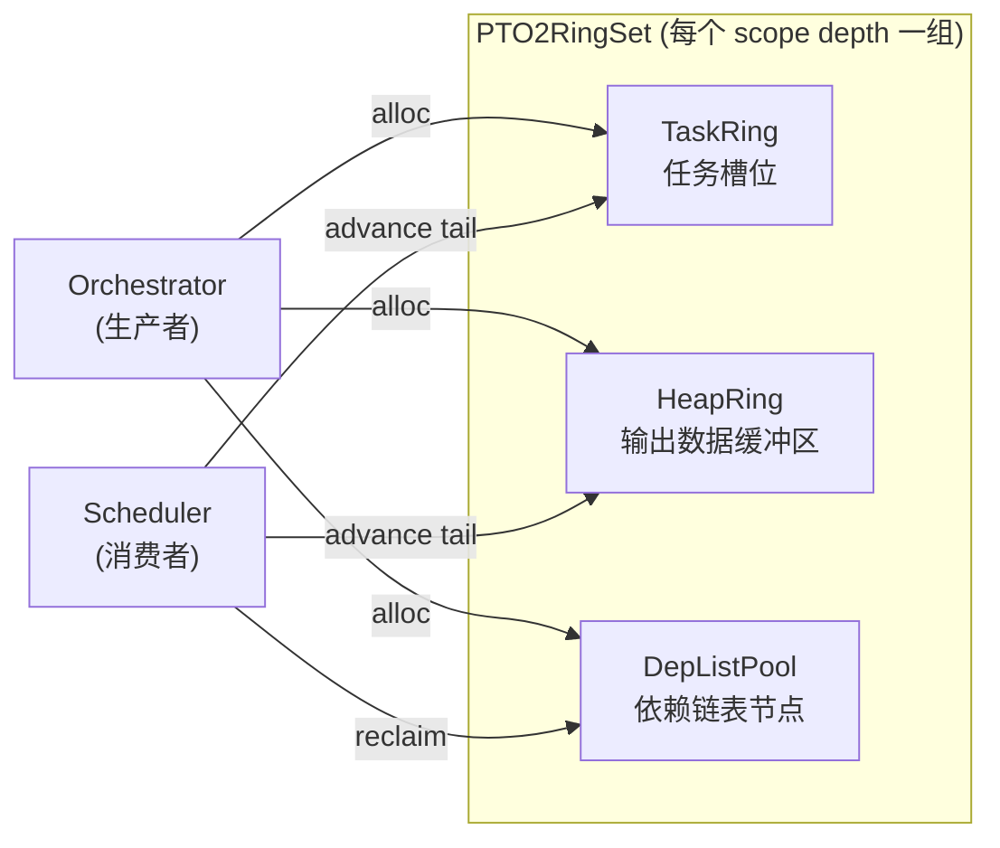
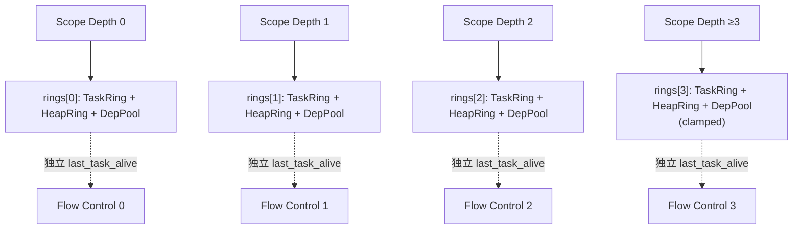
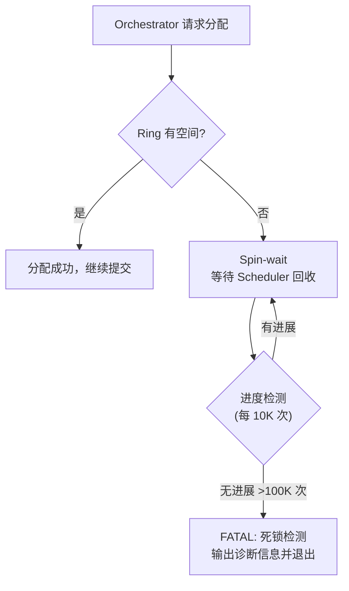
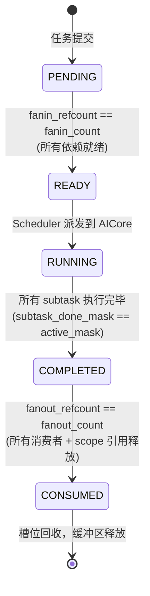
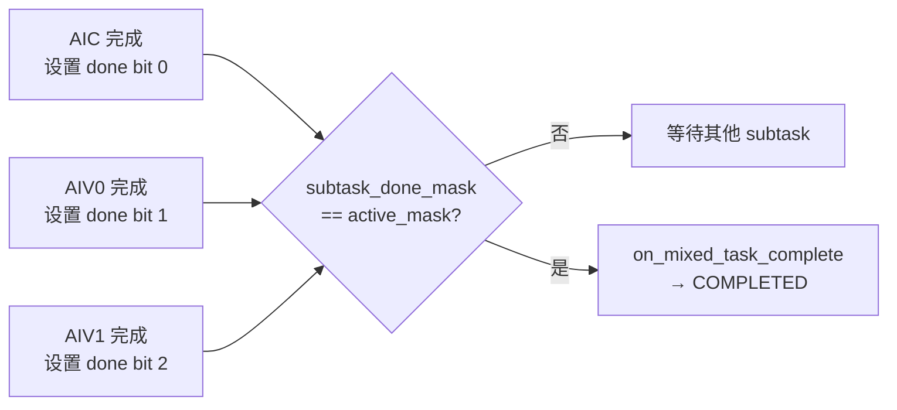
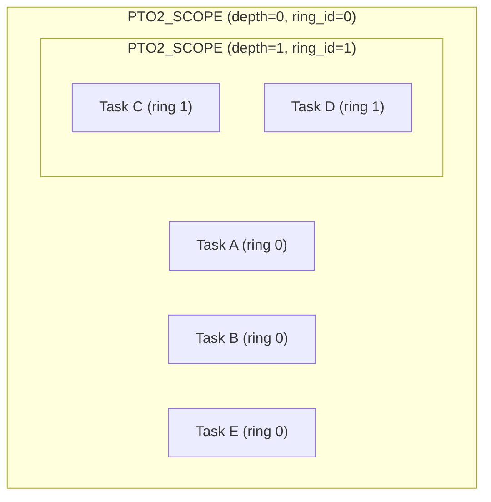
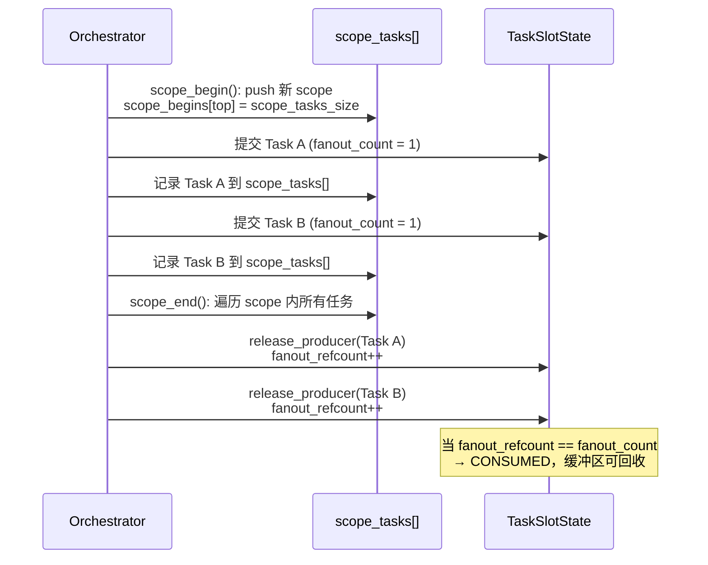
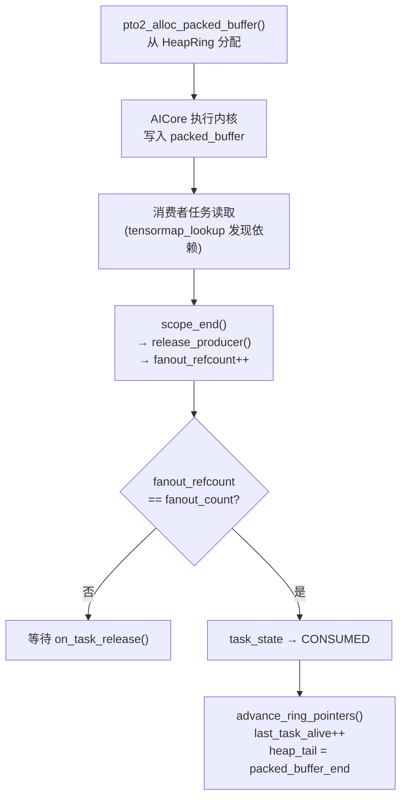

# PTO2 运行时系统：数据流与核心设计

> tensormap_and_ringbuffer 运行时的总体架构、关键数据结构、Task 生命周期与 Scope 内存管理。

## 1. 系统总览

### 1.1 四层架构



### 1.2 三程序模型

| 程序 | 编译产物 | 运行位置 | 职责 |
|------|----------|----------|------|
| **Host** | `.so` | Host CPU | 编译内核、**分配 GM 并拷贝数据**（输入 tensor、内核二进制、编排 SO）、启动设备、收集结果 |
| **AICPU** | `.so` | AICPU ARM 核心 | Orchestrator 构建任务图 + Scheduler 调度执行，读写共享内存流控 |
| **AICore** | `.o` | AICore 计算核心 | 读取 DispatchPayload 和内核二进制，**读写 GM Heap 中的 tensor 数据** |

### 1.3 各层对 GM 的访问模式

| 层 | 写入 GM | 读取 GM |
|----|---------|---------|
| **Host** | 输入 tensor 数据、内核二进制、编排 SO、共享内存缓冲区分配 | 输出 tensor 数据（执行完成后拷回） |
| **Orchestrator** | TaskDescriptor/Payload、Heap 分配指针、TensorMap 条目、流控原子变量 (`heap_top`, `current_task_index`) | 流控原子变量 (`last_task_alive`, `heap_tail`) |
| **Scheduler** | 流控原子变量 (`last_task_alive`, `heap_tail`)、DispatchPayload (per-core) | TaskDescriptor/Payload、流控原子变量 (`current_task_index`, `heap_top`) |
| **AICore** | 输出 tensor 数据（内核执行结果写入 GM Heap） | DispatchPayload、内核二进制 (`func_bin_addr`)、输入 tensor 数据 |

---

## 2. 关键数据结构

### 2.1 结构体关系



### 2.2 热路径与冷路径分离

**设计原则**：将高频访问字段（调度决策相关）与低频字段（参数数据）分离到不同结构体，优化缓存命中率。

| 结构体 | 路径 | 大小 | 访问者 | 核心用途 |
|--------|------|------|--------|----------|
| `PTO2TaskDescriptor` | 热 | ~40B | Orch 写 / Sched 读 | 共享内存中的任务标识和缓冲区指针 |
| `PTO2TaskSlotState` | 热 | 64B (1 cache line) | Sched 读写 | 调度状态、引用计数、完成跟踪 |
| `PTO2TaskPayload` | 冷 | ~3KB | Orch 写 / Dispatch 读 | Tensor 参数、scalar 参数、fanin 列表 |
| `PTO2DepListEntry` | 热 | 16B | Orch 写 / Sched 读 | fanout 链表节点（消费者依赖边） |

### 2.3 TensorMap 哈希表结构

TensorMap 是 Orchestrator 用于依赖发现的全局哈希表，存储"哪个 task 写了哪块 tensor 区域"的映射关系。

**结构**：开链哈希表，以 tensor 的 `buffer.addr`（基地址）为哈希键。同一基地址的所有子区域落在同一个 bucket，通过双向链表链接。新 entry 插入链表头部，因此链表按 task_id 降序排列（最新在前）。

```
bucket[hash(addr)]
    ↓
  entry_B (task=5, shape=[50], offset=[50])  ← 链表头（最新）
    ↓
  entry_A (task=3, shape=[50], offset=[0])
    ↓
  nullptr
```

**Entry 结构**（128B = 2 cache lines）：

| Cache Line | 字段 | 用途 |
|------------|------|------|
| CL1（热路径） | `next_in_bucket`, `producer_task_id`, `buffer_addr`, `version`, `ndims`, `shapes[]` | 链表遍历 + 重叠检测 |
| CL2（冷路径） | `prev_in_bucket`, `next_in_task`, `prev_in_task`, `offsets[]` | 链表增删 + 非零偏移场景 |

当 `is_all_offset_zero` 为 true 时，lookup 只需访问 CL1 即可完成重叠检测。

**多 Producer 处理流程**：

Task 提交时，Orchestrator 按以下步骤处理 tensor 参数的依赖：

**① Insert（写入）**：每个 producer task 的 OUTPUT/INOUT 参数各自调用 `insert()`，在 bucket 链表头部插入独立 entry。多个 task 写同一 tensor 的不同子区域时，链表中同时存在多个 entry。

**② Lookup（查找）**：consumer task 的 INPUT/INOUT 参数调用 `lookup()`，遍历整个 bucket 链表，对每个有效 entry 调用 `check_overlap()` 进行多维区间重叠检测——逐维比较 `[offset, offset+shape)` 是否相交。返回最多 16 个重叠 producer 及其重叠状态（`COVERED` = 完全覆盖 / `OTHER` = 部分重叠）。

**③ 去重构建 fanin**：对 lookup 返回的所有 producer，按 `PTO2TaskSlotState*` 指针去重后加入当前 task 的 `fanin_states[]` 列表。`fanin_count` = 唯一 producer 数量。

**④ INOUT 链式依赖优化**：若 INOUT tensor 完全覆盖（`COVERED`）了某个旧 producer entry，则从 TensorMap 中删除被覆盖的旧 entry（分配 buffer 的初始 entry 除外，以保证 tensor 生命周期正确）。这样后续 task 只需依赖最近的 INOUT writer，形成链式依赖，避免 fanin 列表膨胀。

```
示例：两个 Producer，一个 Consumer

Task A: 写 tensor[0:50]   → insert entry_A
Task B: 写 tensor[50:100] → insert entry_B

TensorMap bucket: entry_B → entry_A → ...

Task C: 读 tensor[0:100]
  ① lookup() 遍历链表，check_overlap 发现 entry_A、entry_B 都重叠
  ② 去重后 fanin_states = [A, B], fanin_count = 2
  ③ Task C 等待 A、B 都完成后才变为 READY
```

**失效与清理**：见 [5.5 TensorMap 清理三层防线](#55-tensormap-清理三层防线)。

---

## 3. Ring Buffer 与 Multi-Ring 设计

### 3.1 三种 Ring Buffer

Orchestrator（生产者）提交任务时需要分配三类资源，每类对应一种 Ring Buffer：

- **TaskRing**：管理**任务槽位**。每提交一个任务需要占用一个槽位来存放 TaskDescriptor 和 TaskSlotState。槽位数量有限（默认 16K），已完成的任务释放槽位供后续任务复用。
- **HeapRing**：管理**输出数据缓冲区**。每个任务的 OUTPUT tensor 需要在 GM Heap 上分配连续内存，内核执行时将结果写入此区域。任务被消费后缓冲区回收。
- **DepListPool**：管理**依赖链表节点**。每条 producer→consumer 依赖边需要一个 `DepListEntry` 节点。任务退休后节点批量回收。

三种 Ring 共同构成 Orchestrator 和 Scheduler 之间的**背压流控**：任一 Ring 耗尽时 Orchestrator 阻塞，直到 Scheduler 完成任务并回收资源。



| Ring 类型 | 分配方式 | 回收触发 | 背压条件 |
|-----------|----------|----------|----------|
| **TaskRing** | `current_index++` 单调递增 | `last_task_alive` 推进 | `active_count >= window_size - 1` |
| **HeapRing** | `top` 指针 bump 分配，到底回绕 | `heap_tail` 由 Scheduler 推进 | 无连续可用空间 |
| **DepListPool** | `top++` 线性分配 | 按任务退休批量回收 | `top - tail >= capacity` |

### 3.2 Multi-Ring 架构

#### 问题：单 Ring 的水位阻塞

Ring 的水位（`last_task_alive`）只能从最老的任务开始顺序推进。当不同 scope 层级的任务混在同一个 Ring 时，外层 scope 的长生命周期任务会卡住水位，导致内层已完成的短任务无法回收。

```
// 单 Ring 下的死锁场景（假设 Ring window=128）：
PTO2_SCOPE(rt) {
    submit_task(Init);                  // local_id=0，要等最外层 scope_end 才释放
    for (int i = 0; i < 1000; i++) {
        PTO2_SCOPE(rt) {
            submit_task(Step_i);        // local_id=1,2,3,...
        }
    }
    submit_task(Final);
}

Ring: [Init, Step_0, Step_1, ..., Step_126, ...]
       ↑ last_task_alive=0 （Init 未 CONSUMED，水位卡死）

Step_0~Step_126 早已完成，但水位无法越过 Init → 槽位不回收 → Ring 满 → 死锁
```

#### 解决方案：按 scope 深度分配到不同 Ring

映射规则：`ring_id = min(scope_depth, 3)`，共 4 组独立的 Ring 实例。



#### 具体分配示例

```
PTO2_SCOPE(rt) {                          // depth=0 → ring_id=0
    submit_task(Init);                     // → ring 0, local_id=0

    for (int i = 0; i < 1000; i++) {
        PTO2_SCOPE(rt) {                  // depth=1 → ring_id=1
            submit_task(Step_i);           // → ring 1, local_id=i
        }                                  // scope_end: Step_i 可回收
    }

    submit_task(Final);                    // → ring 0, local_id=1
}                                          // scope_end: Init、Final 可回收
```

分配结果：

```
Ring 0: [Init(id=0), Final(id=1)]        ← 外层任务，水位被 Init 卡住
Ring 1: [Step_0, Step_1, ..., Step_999]   ← 内层任务，水位持续推进、槽位持续回收
```

Ring 1 独立回收，不受 Ring 0 水位阻塞。同深度的不同 scope（如循环的每次迭代）共享同一个 Ring，local_id 在 ring 内连续递增。

#### 为什么是 4 个 Ring

每个 Ring 是一整套资源，内存开销显著：

| 资源 | 每个 Ring | 4 个 Ring 总量 |
|------|----------|--------------|
| TaskRing | 16,384 槽位 | 65,536 槽位 |
| HeapRing | 256 MB | 1 GB |
| DepListPool | 16,384 节点 | 65,536 节点 |

4 个 Ring 是工程权衡：depth 0~2 覆盖绝大多数编排模式（整体图 → layer 循环 → 子步骤），depth ≥ 3 clamp 到 ring 3。深层 scope 通常很短（嵌套越深任务越少、生命周期越短），即使共享 ring 3 也很难填满 16K 槽位。更多 Ring 的收益递减，但内存开销线性增长。

### 3.3 跨 Ring 数据依赖

Multi-Ring 下不同 scope 深度的任务位于不同 Ring 中，但它们之间可以存在数据依赖。例如内层 scope 的任务读取外层 scope 任务的输出：

```
PTO2_SCOPE(rt) {                       // depth=0 → ring 0
    auto t = make_tensor(...);
    submit_task(Init, out=t);           // Init 在 ring 0

    PTO2_SCOPE(rt) {                   // depth=1 → ring 1
        submit_task(Step, in=t);        // Step 在 ring 1，读取 ring 0 的 Init 输出
    }
}
```

跨 Ring 依赖涉及两个层面：

**1. 依赖发现（TensorMap）**：TensorMap 是全局共享的哈希表，所有 Ring 的条目混合存储在同一个 bucket chain 中。lookup 时遍历 bucket chain 不区分 Ring，因此 Step（ring 1）查找 tensor `t` 的 producer 时，自然能发现 Init（ring 0）。

**2. 依赖通知（fanout 指针）**：依赖边通过 `PTO2TaskSlotState*` 指针建立。指针天然包含目标地址信息，不需要任何 Ring 标识判断：

```
Ring 0 的 Init (producer)
    └── fanout_head → DepListEntry.slot_state ──→ Ring 1 的 Step (consumer)

Init 完成时，Scheduler 遍历 fanout 链表，通过指针直接操作
Step 的 fanin_refcount.fetch_add()，无需知道 Step 在哪个 Ring。
```

**3. 水位独立性**：跨 Ring 依赖不影响各 Ring 的水位独立推进。Ring 0 的 Init 完成后通知 Ring 1 的 Step，但两个 Ring 的 `last_task_alive` 各自独立推进。Step 的完成推进的是 ring 1 的水位，不涉及 ring 0。

### 3.4 TaskId 64 位编码

```
mixed_task_id.raw = (ring_id << 32) | local_id

高32位: ring_id (0~3)     低32位: local_id (单调递增)
├──────────────────────┤├──────────────────────────────┤
  哪个 ring 层                  ring 内的任务序号
```

### 3.5 流控与背压



---

## 4. Task 生命周期

### 4.1 状态机



### 4.2 fanin / fanout 依赖关系

**fanin（入边）**：当前任务依赖哪些 producer

| 字段 | 位置 | 语义 |
|------|------|------|
| `fanin_count` | TaskSlotState | 生产者依赖总数（提交时确定） |
| `fanin_refcount` | TaskSlotState (atomic) | 已完成的生产者数（生产者完成时递增） |
| `fanin_slot_states[16]` | TaskPayload | 所有 producer 的 SlotState 指针列表（完成后用于释放 producer 的 fanout 引用） |

> **为什么 `fanin_slot_states[]` 在 TaskPayload 而非 TaskSlotState？**
> TaskSlotState 严格限制为 64 字节（1 cache line），而该数组为 16 × 8 = 128 字节，放不进去。
> 且该数组仅在冷路径 `on_task_release()` 中访问（任务完成后释放 producer 引用），不影响热路径性能。

**fanout（出边）**：哪些 consumer 依赖当前任务的输出

| 字段 | 位置 | 语义 |
|------|------|------|
| `fanout_count` | TaskSlotState | 总引用数 = 1 (scope 引用) + 消费者数 |
| `fanout_refcount` | TaskSlotState (atomic) | 已释放的引用数（scope_end 或消费者完成时递增） |
| `fanout_head` | TaskSlotState | 消费者单向链表头（`DepListEntry` 链，每个节点指向一个消费者的 SlotState） |

**数据流**：提交任务 B 时，如果 B 读取了任务 A 的输出，Orchestrator 会：
1. 将 A 的 SlotState 指针记录到 B 的 `fanin_slot_states[]`
2. 将 B 的 SlotState 指针通过 `DepListEntry` 挂到 A 的 `fanout_head` 链表上

### 4.3 两阶段混合任务完成

一个 mixed task 可包含最多 3 个 subtask（AIC + AIV0 + AIV1）：



---

## 5. Scope 与内存管理

### 5.1 Scope 嵌套模型



### 5.2 scope_begin / scope_end 语义

**`scope_begin()`**：
1. `scope_stack_top++`（进入新层级）
2. 记录 `scope_begins[top] = scope_tasks_size`（标记当前 scope 在 `scope_tasks[]` 中的起始位置）
3. 此后提交的每个任务：`fanout_count` 初始化为 1（1 = scope 持有的引用），并将其 SlotState 指针追加到 `scope_tasks[]`

**`scope_end()`**：
1. 遍历 `scope_tasks[scope_begins[top] .. scope_tasks_size)`，对 scope 内每个任务调用 `release_producer()`（即 `fanout_refcount++`）
2. 若某任务的 `fanout_refcount == fanout_count`（scope 引用是最后一个引用），触发 CONSUMED 状态转换
3. `scope_tasks_size` 回退到 `scope_begins[top]`，`scope_stack_top--`（退出当前层级）

### 5.3 Scope 生命周期时序



### 5.4 packed_buffer 生命周期

每个任务的所有 OUTPUT tensor 的数据**打包到一块连续的 GM 内存**中，称为 packed_buffer。提交任务时，Orchestrator 累加所有 OUTPUT tensor 的大小（按 1024B 对齐），一次性从 HeapRing 分配整块空间，再按偏移将各 tensor 的 `buffer.addr` 指向其中的对应位置：

```
packed_buffer_base                                    packed_buffer_end
│                                                              │
▼                                                              ▼
┌──────────────────┬──────────────────┬──────────────────┬─────┐
│  OUTPUT tensor 0 │  (1024B align pad) │  OUTPUT tensor 1 │ ... │
└──────────────────┴──────────────────┴──────────────────┴─────┘
```



### 5.5 TensorMap 清理三层防线

| 层级 | 触发条件 | 方法 | 保证 |
|------|----------|------|------|
| 链截断 | 每次 lookup | 截断 bucket chain 的过期尾部 | lookup 只遍历有效条目 |
| 周期性清理 | 每退休 64 个任务 | 遍历 per-task 条目链释放 | 有限时间内回收池容量 |
| 背压阻塞 | 条目池耗尽 | 阻塞直到 Scheduler 推进水位 | 硬容量上限，不会 OOM |

---

## 6. 配置参数

| 参数 | 默认值(每个 ring) | 总量(×4 rings) | 环境变量覆盖 |
|------|-------------------|----------------|--------------|
| Task Window | 16,384 | 65,536 | `PTO2_RING_TASK_WINDOW` |
| Heap Size | 256 MB | 1 GB | `PTO2_RING_HEAP` |
| DepList Pool | 16,384 | 65,536 | `PTO2_RING_DEP_POOL` |
| TensorMap Pool | 65,536 | 65,536 (全局) | — |
| Ready Queue | 65,536 | 65,536 (全局) | — |

---

> 详细的 Orchestration 和 Scheduler 处理流程见 [02-Orchestration处理流程.md](02-Orchestration处理流程.md) 和 [03-Scheduler处理流程.md](03-Scheduler处理流程.md)。
