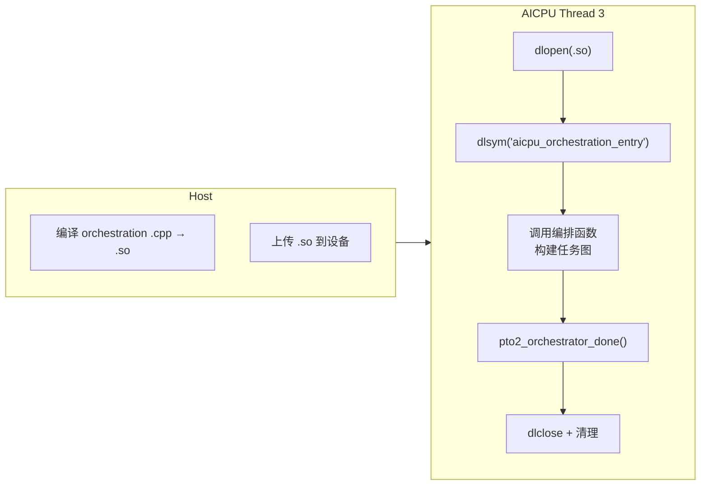
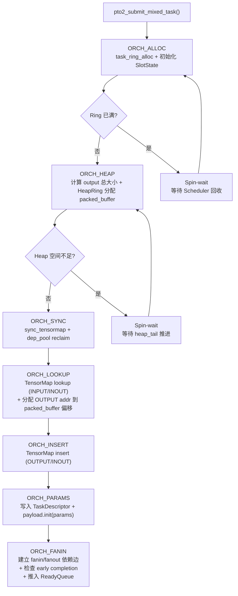
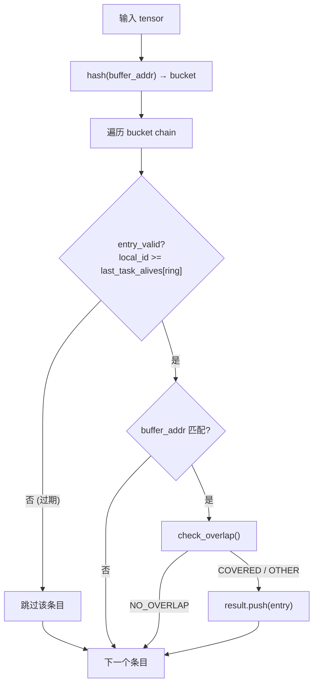
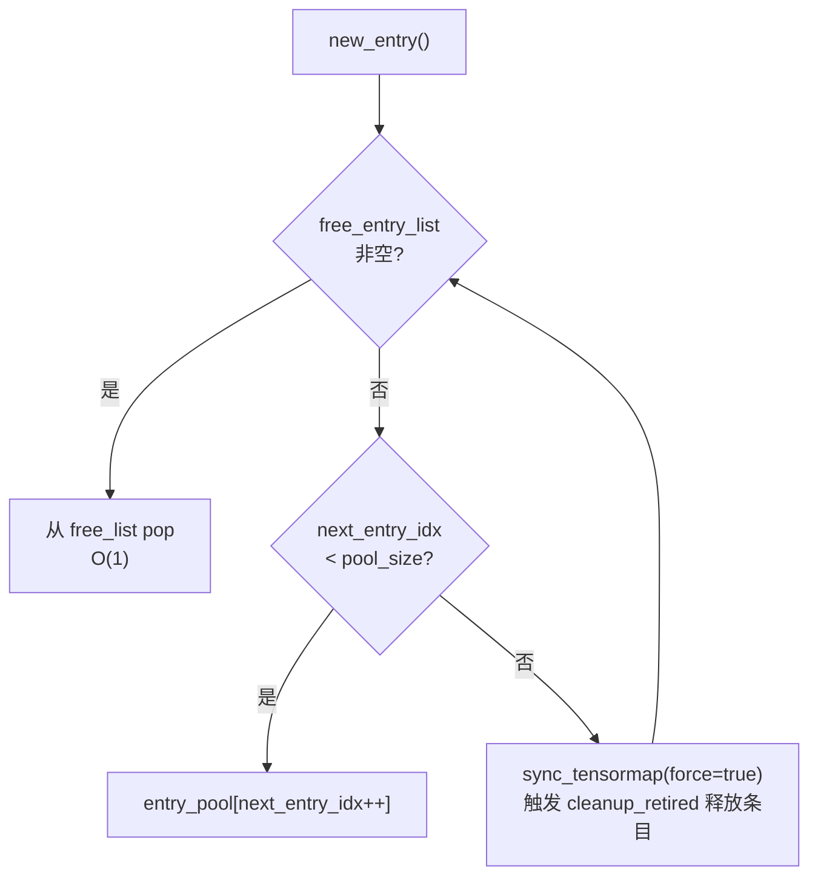
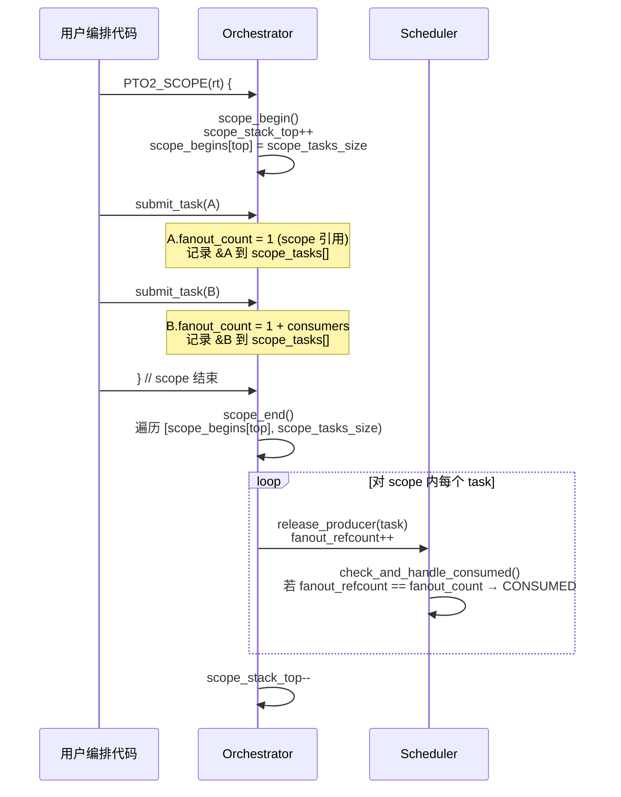
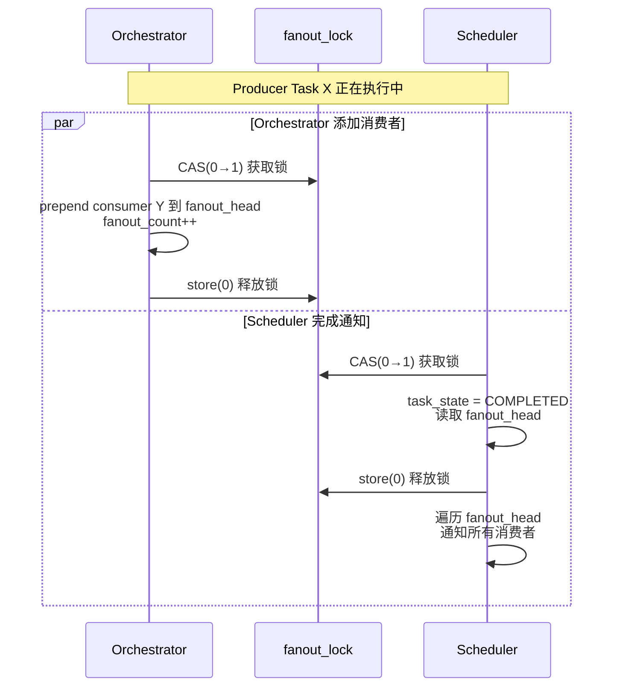

# Orchestration 处理流程

> Orchestrator 的职责、Task 提交流水线、TensorMap 依赖发现、Scope 管理与并发锁协议。

## 1. Orchestrator 角色与职责

Orchestrator 运行在 **AICPU Thread 3**（单线程），负责执行用户的编排函数并构建任务图。



**核心职责**：
1. 执行编排函数（图灵完备的控制流：循环、条件分支等）
2. 从 HeapRing 分配中间缓冲区
3. 通过 `pto2_submit_mixed_task` 提交异步任务
4. 利用 TensorMap 自动发现依赖关系
5. 管理 Scope 控制缓冲区生命周期

---

## 2. Task 提交流水线

`pto2_submit_mixed_task()` 内部按 profiling 阶段划分为 7 个步骤（对应 `CYCLE_COUNT_LAP_RECORD` 中的 `AicpuPhaseId`）：

### 2.1 完整流程



### 2.2 各阶段详解

| 阶段 | PhaseId | 关键操作 | 说明 |
|------|---------|----------|------|
| 1 | `ORCH_ALLOC` | `task_ring_alloc()` | 从当前 ring (min(scope_depth, 3)) 分配 Task 槽位；初始化 `SlotState`（设置 `active_mask`、`ring_id`、payload 指针）；将任务加入 `scope_tasks[]` |
| 2 | `ORCH_HEAP` | `pto2_alloc_packed_buffer()` | 遍历参数累加 OUTPUT tensor 大小（按 1024B 对齐），从 HeapRing 一次性 bump 分配 packed_buffer |
| 3 | `ORCH_SYNC` | `sync_tensormap()` + `dep_pool.reclaim()` | 读取 `last_task_alive`，更新 TensorMap 的 per-ring 有效性水位；回收已退休任务的 DepPool 条目 |
| 4 | `ORCH_LOOKUP` | `tensormap.lookup()` | 对每个 INPUT/INOUT tensor 查找 producer（hash → bucket chain → overlap 检测），收集 `fanin_states[]`；同时将 OUTPUT tensor 的 `buffer.addr` 指向 packed_buffer 内偏移 |
| 5 | `ORCH_INSERT` | `tensormap.insert()` | 将 OUTPUT/INOUT tensor 注册到 TensorMap bucket 头部（保证最新 task_id 在前）|
| 6 | `ORCH_PARAMS` | `payload->init(params)` | 批量写入 GM：设置 `TaskDescriptor` 字段（`mixed_task_id`、`kernel_id[]`、`packed_buffer_base/end`）；拷贝 tensor 和 scalar 参数到 `TaskPayload` |
| 7 | `ORCH_FANIN` | `pto2_fanout_lock()` + `dep_pool.prepend()` | 对每个 producer：加 `fanout_lock` → `fanout_count++` → 若 producer 未完成则 prepend 到 `fanout_head` 链表，否则计入 `early_finished`；最后合并 `early_finished + 1` 做一次 `fanin_refcount.fetch_add()`，若已满足则直接推入 ReadyQueue |

---

## 3. TensorMap 依赖发现

### 3.1 数据结构

TensorMap 是一个**哈希表 + 条目池**的结构，用于将 tensor 内存区域映射到 producer task_id：

- **`buckets[]`**：哈希桶数组（65536 个），每个桶是一个双向链表头
- **`entry_pool[]`**：预分配的 `PTO2TensorMapEntry` 条目池（65536 个），配合 `free_entry_list` 回收复用
- **`task_entry_heads[ring_id][slot]`**：per-ring per-task 的条目双向链表头，用于按任务批量清理

**哈希策略**：仅按 `buffer_addr`（tensor base 指针）哈希。同一 base_ptr 的所有子 tensor 落入同一 bucket，使重叠检测在局部完成。

### 3.2 关键方法

#### `lookup(tensor, result)`

查找与输入 tensor 存在内存重叠的所有 producer。



**实现要点**：
- 遍历时 `__builtin_prefetch` 预取下一个条目，隐藏指针追踪延迟
- 过期条目跳过（不截断，因为 Multi-Ring 下不同 ring 的条目交错排列，一个 ring 过期不代表后续条目也过期）
- `check_overlap()` 分快慢路径：双方 offset 均为 0 时只比较 shapes（仅访问 cache line 1）；否则逐维计算线段交集

#### `insert(tensor, producer_task_id, with_alloc)`

将 OUTPUT/INOUT tensor 注册为指定任务的产出。

**实现**：
1. `hash(buffer_addr)` 定位 bucket
2. `new_entry()` 从条目池分配（free list 优先，否则 bump allocation）
3. `copy_from_tensor()` 拷贝 overlap 检测所需字段（addr、version、shapes、offsets）
4. **prepend 到 bucket 头部**（保证 task_id 降序，新条目在前）
5. **prepend 到 `task_entry_heads[ring][slot]`** 链表（用于 cleanup_retired 按任务清理）

#### `cleanup_retired(ring_id, old_alive, new_alive)`

批量释放已退休任务（`[old_alive, new_alive)` 范围）的所有 TensorMap 条目。

**实现**：
1. 遍历 `[old_alive, new_alive)` 中每个 local_id
2. 通过 `task_entry_heads[ring][slot]` 找到该任务的所有条目
3. 对每个条目调用 `free_entry()`：从 bucket 双向链表中 O(1) 摘除，归还到 `free_entry_list`
4. 清空 `task_entry_heads[ring][slot] = nullptr`

#### `sync_tensormap(ring_id, sm_last_task_alive)`

同步 per-ring 有效性水位。当 `last_task_alive` 推进超过 `PTO2_TENSORMAP_CLEANUP_INTERVAL`（默认 64）个任务时，触发 `cleanup_retired` 批量清理。

### 3.3 条目池管理

条目池使用 **free list + bump allocation** 两级分配策略：



**`cleanup_retired` 是条目池回收的唯一来源**：`cleanup_retired` 遍历已退休任务的所有条目，调用 `free_entry()` 将条目从 bucket 链表中摘除并归还到 `free_entry_list`。`new_entry()` 优先从 `free_entry_list` 分配，形成"分配→使用→退休→回收→复用"的闭环。当 bump allocation 耗尽且 free list 为空时，强制触发 `sync_tensormap(force=true)` → `cleanup_retired`，将已退休但尚未清理的条目批量回收到 free list，解除阻塞。

---

## 4. Scope 管理

### 4.1 scope_tasks 缓冲区布局

Scope 使用一个**平坦缓冲区** `scope_tasks[]` 存储所有 scope 层级的任务指针，通过 `scope_begins[]` 数组划分边界：

```
scope_tasks[]:
┌──────────────┬──────────────┬──────────────┐
│  Scope 0 任务  │  Scope 1 任务  │  Scope 2 任务  │
└──────────────┴──────────────┴──────────────┘
 ↑              ↑              ↑
 scope_begins[0] scope_begins[1] scope_begins[2]
```

### 4.2 scope_begin / scope_end 流程



### 4.3 Scope 与 Ring 映射

任务提交时，Orchestrator 根据当前 scope 深度选择 Ring：`ring_id = min(scope_stack_top, 3)`。同深度的不同 scope 共享同一个 Ring，local_id 在 ring 内连续递增。

```
PTO2_SCOPE(rt) {                          // depth=0 → ring 0
    submit_task(Matmul);                   // → ring 0, local_id=0

    PTO2_SCOPE(rt) {                      // depth=1 → ring 1
        submit_task(Add);                  // → ring 1, local_id=0
        submit_task(Relu);                 // → ring 1, local_id=1
    }                                      // scope_end: Add、Relu 可回收，ring 1 水位推进

    PTO2_SCOPE(rt) {                      // depth=1 → 还是 ring 1（同深度共享）
        submit_task(Softmax);              // → ring 1, local_id=2
    }                                      // scope_end: Softmax 可回收

    submit_task(Store);                    // → ring 0, local_id=1
}                                          // scope_end: Matmul、Store 可回收
```

这使得内层 scope 的短生命周期任务在独立 Ring 中快速回收，不被外层长生命周期任务的水位阻塞。Multi-Ring 的详细设计动机和内存开销分析见 [01-数据流与核心设计.md § 3.2](01-数据流与核心设计.md)。

---

## 5. 并发锁协议

### 5.1 fanout_lock 协议

Orchestrator（添加消费者）和 Scheduler（完成通知遍历 fanout）**并发访问**同一个 producer 的 fanout 链表，通过 per-task spinlock (`fanout_lock`) 互斥。



**关键保证**：锁只保护 `fanout_head` 和 `fanout_count` 的读写。Scheduler 释放锁后，遍历链表时不需要持锁。这是安全的，因为：

1. **链表只增不删**：fanout 链表是 append-only 的（只有 prepend 操作，没有删除），Scheduler 在释放锁时已快照了 `fanout_head`，后续即使 Orchestrator prepend 新节点，也不影响已快照的链表部分
2. **COMPLETED 状态阻断新 prepend**：Scheduler 在锁内将 `task_state` 设为 `COMPLETED`。之后 Orchestrator 在 `ORCH_FANIN` 阶段发现 producer 已 COMPLETED，会走 `early_finished` 路径（直接计入 fanin_refcount），不再 prepend 到 fanout 链表
3. **通知操作是原子的**：遍历链表后对消费者的 `fanin_refcount.fetch_add()` 是 atomic 操作，无需额外锁保护

### 5.2 跨 Ring 依赖

Multi-Ring 架构下，不同 scope 深度的任务位于不同 Ring 中，但它们之间可以存在数据依赖。例如外层 scope（ring 0）的 Task A 产出一个 tensor，内层 scope（ring 1）的 Task B 读取该 tensor——这就形成了一条跨 Ring 的依赖边。

**设计**：依赖边使用 `PTO2TaskSlotState*` 指针建立，**天然跨 Ring**，无需任何 Ring 标识判断：

```
Ring 0 的 Task A (producer)
    └── fanout_head → DepListEntry → Ring 1 的 Task B (consumer)
                                        └── slot_state 指针直接指向 Ring 1

当 A 完成时，Scheduler 遍历 fanout_head，通过指针直接操作 B 的 fanin_refcount，
无需任何 Ring 标识判断 —— 指针天然包含了目标位置信息。
```

TensorMap 的 lookup 也天然跨 Ring：查找时遍历 bucket chain 中所有有效条目，不区分 producer 所在的 Ring。这保证了 Orchestrator 能正确发现跨 scope 的数据依赖。

---

## 6. Orchestration API 速览

| API | 说明 |
|-----|------|
| `pto2_rt_submit_task(rt, mixed_kernels, params, n)` | 提交混合任务 (AIC + AIV) |
| `pto2_rt_submit_aic_task(rt, kernel_id, params, n)` | 便捷接口：提交 AIC-only 任务 |
| `pto2_rt_submit_aiv_task(rt, kernel_id, params, n)` | 便捷接口：提交 AIV-only 任务 |
| `PTO2_SCOPE(rt) { ... }` | RAII scope，控制缓冲区生命周期 |
| `make_tensor(shapes, ndim, dtype)` | 创建中间 tensor (addr=0，由 HeapRing 自动分配) |
| `make_tensor_external(ptr, shapes, ndim, dtype)` | 包装已有设备指针为 tensor |
| `make_input_param(tensor)` | INPUT 参数（只读） |
| `make_output_param(tensor)` | OUTPUT 参数（写入，自动分配） |
| `make_inout_param(tensor)` | INOUT 参数（先读后写） |
| `make_scalar_param(value)` | 64-bit 标量参数 |

---

> Scheduler 的主循环、完成处理、任务调度和 AICore 交互协议详见 [03-Scheduler处理流程.md](03-Scheduler处理流程.md)。
