# Scheduler 处理流程

> Scheduler 的线程模型、主循环、完成处理、任务调度、AICore 交互协议与水位推进机制。

## 1. 线程模型

### 1.1 四线程分配

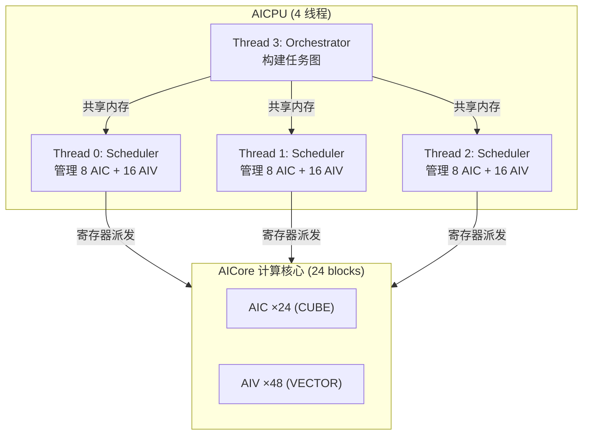

每个 block = 1 AIC + 2 AIV。24 blocks 的 AIC/AIV 核心均分给 3 个 Scheduler 线程。

### 1.2 启动同步

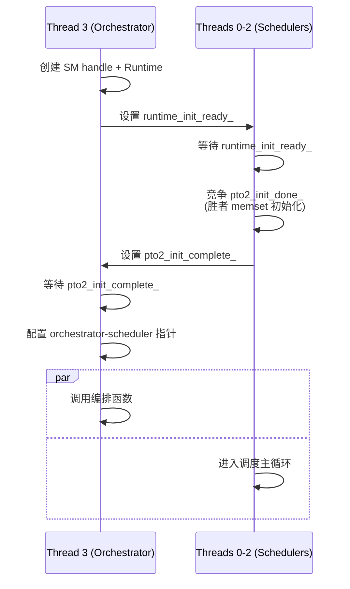

---

## 2. Scheduler 主循环

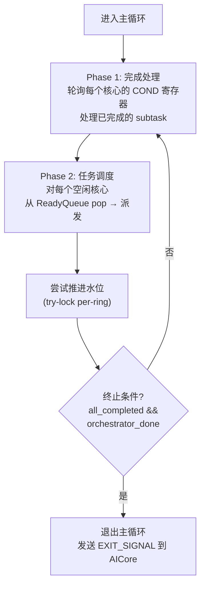

---

## 3. 完成处理流程 (Phase 1)

### 3.1 两阶段完成

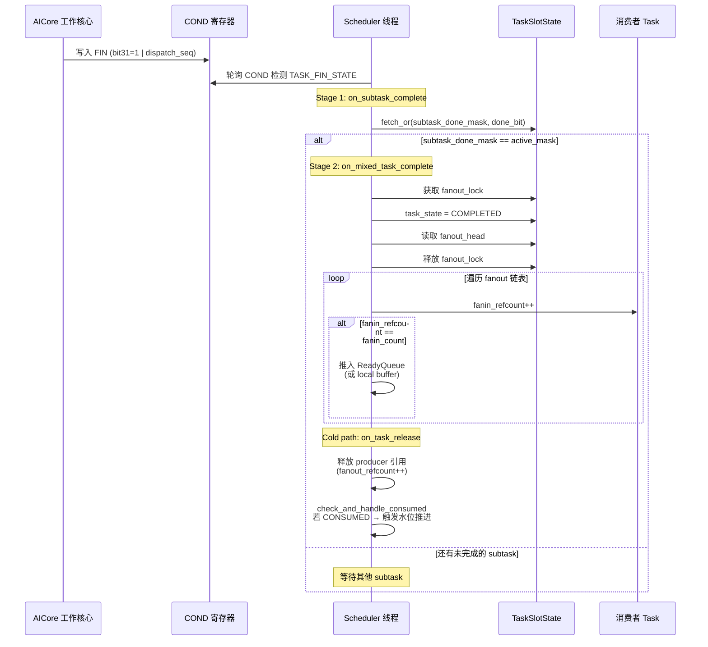

### 3.2 完成处理关键步骤

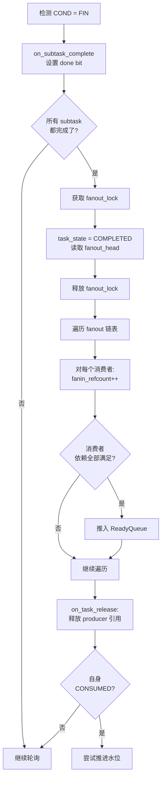

---

## 4. 任务调度流程 (Phase 2)

### 4.1 调度流程

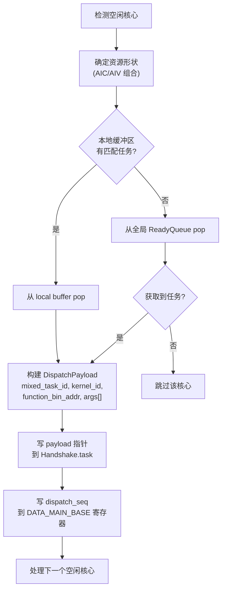

### 4.2 Ready Queue 设计

5 种 **ResourceShape** 队列，基于 Lock-free Bounded MPMC (Vyukov) 设计：

| Shape | active_mask 含义 | 说明 |
|-------|-----------------|------|
| `AIC_ONLY` | 仅 AIC | 矩阵运算 (matmul) |
| `AIV_X1` | 仅 AIV0 或 AIV1 | 单 AIV 向量运算 |
| `AIV_X2` | AIV0 + AIV1 | 双 AIV 向量运算 |
| `AIC_AIV_X1` | AIC + 1个 AIV | AIC + 单 AIV 混合 |
| `AIC_AIV_X2` | AIC + AIV0 + AIV1 | 全 cluster 占用 |

**Vyukov MPMC Queue 特性**：
- `enqueue_pos` 和 `dequeue_pos` 在不同 cache line（避免 false sharing）
- 每个 slot 有 sequence counter（防止 ABA 问题）
- 空队列 pop 只需一次 atomic load（快速路径）

### 4.3 Local-first 优化

每个 Scheduler 线程维护 2 个**线程本地缓冲区**（按 CoreType 分类：AIC=0, AIV=1）：

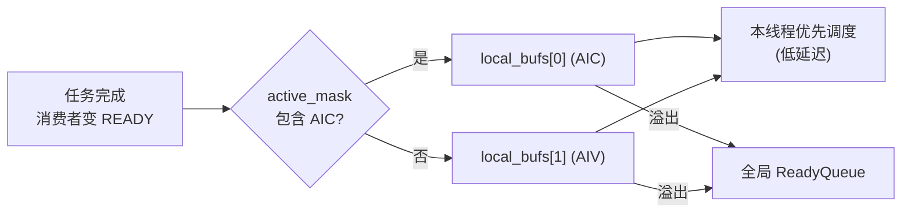

优势：当生产者和消费者在同一线程管理的核心上时，避免全局队列的 CAS 竞争。

---

## 5. AICore 交互协议

### 5.1 寄存器交互

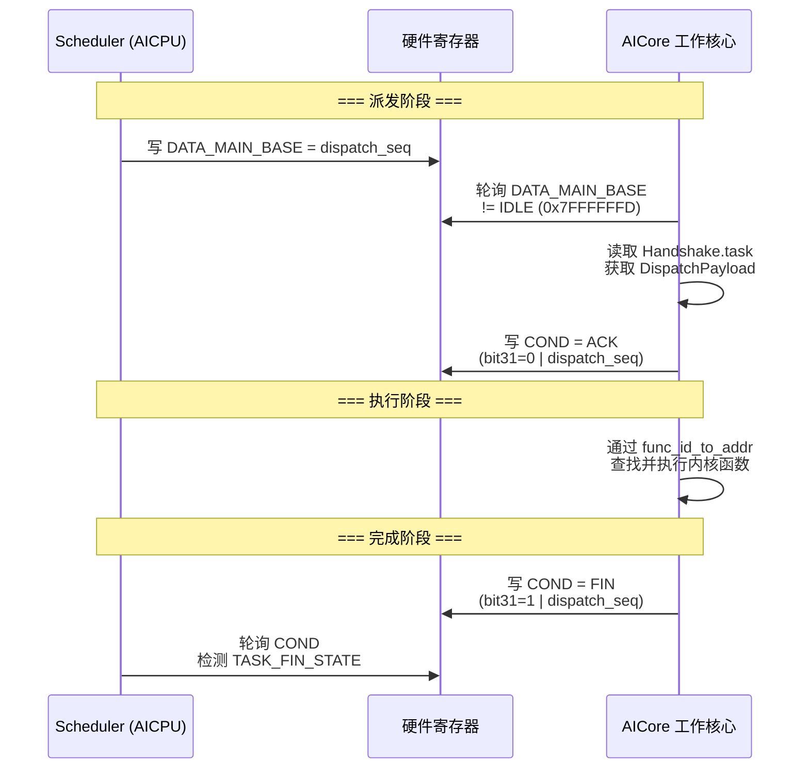

**寄存器定义** (32-bit, per-core)：

| 寄存器 | 方向 | 编码 |
|--------|------|------|
| `DATA_MAIN_BASE` | AICPU→AICore | dispatch_seq (单调递增)；`0xFFFFFFFE` = EXIT |
| `COND` | AICore→AICPU | bit31=0: ACK, bit31=1: FIN；低31位 = dispatch_seq |

### 5.2 Multi-Ring dispatch_seq

32 位寄存器无法容纳 64 位 `mixed_task_id`。如果直接截断，不同 ring 的 `local_id=0` 会产生**碰撞**。

**解决方案**：每个核心维护单调递增的 `s_dispatch_seq[core_id]`，替代 `mixed_task_id` 写入寄存器：

```
Ring 0, local_id=0 → dispatch_seq = 1  (唯一)
Ring 1, local_id=0 → dispatch_seq = 2  (唯一)
Ring 0, local_id=1 → dispatch_seq = 3  (唯一)
```

AICore 通过 `last_reg_val` 对比检测新任务到来，保证不会误判。

### 5.3 DispatchPayload 结构

| 字段 | 说明 |
|------|------|
| `mixed_task_id` | 64-bit 混合任务标识（用于完成聚合） |
| `subslot` | 子任务槽位 (AIC / AIV0 / AIV1) |
| `kernel_id` | 内核函数 ID |
| `core_type` | AIC 或 AIV |
| `function_bin_addr` | GM 中的内核二进制地址 |
| `num_args` | 参数数量 |
| `args[]` | Tensor 地址和 scalar 值 |

---

## 6. 水位推进 (Watermark Advancement)

### 6.1 推进流程

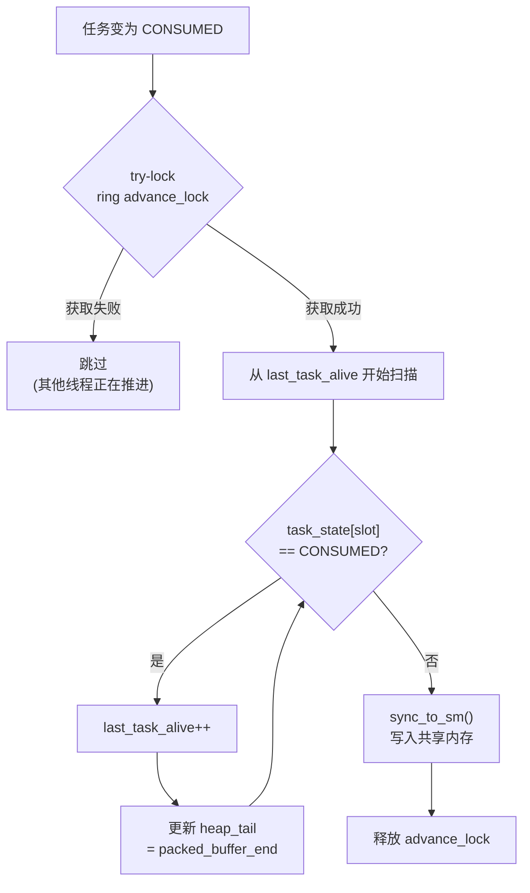

### 6.2 Per-Ring 独立推进

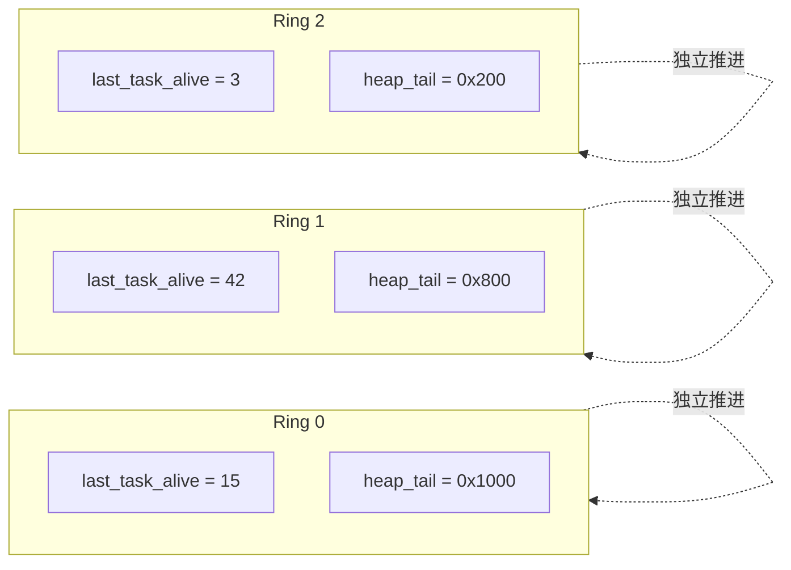

每个 ring 有独立的 `advance_lock` (try-lock)：
- **多线程安全**：多个 Scheduler 线程可能同时尝试推进同一 ring，try-lock 保证只有一个线程执行扫描
- **无阻塞**：获取锁失败的线程直接跳过，不会被阻塞——获胜的线程会扫描到当前已 CONSUMED 的所有任务

### 6.3 水位推进对流控的影响

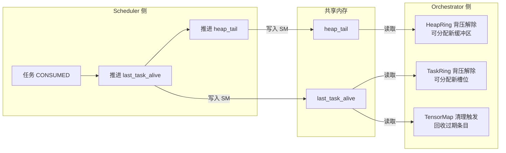

**循环闭合**：Scheduler 推进水位 → Orchestrator 解除背压 → 提交更多任务 → Scheduler 执行更多任务 → 推进水位。这是系统**稳态流水线**运行的核心反馈环。

---

> 系统总体架构和数据结构详见 [01-数据流与核心设计.md](01-数据流与核心设计.md)，Orchestration 处理流程详见 [02-Orchestration处理流程.md](02-Orchestration处理流程.md)。
