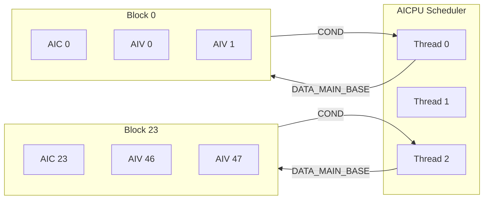
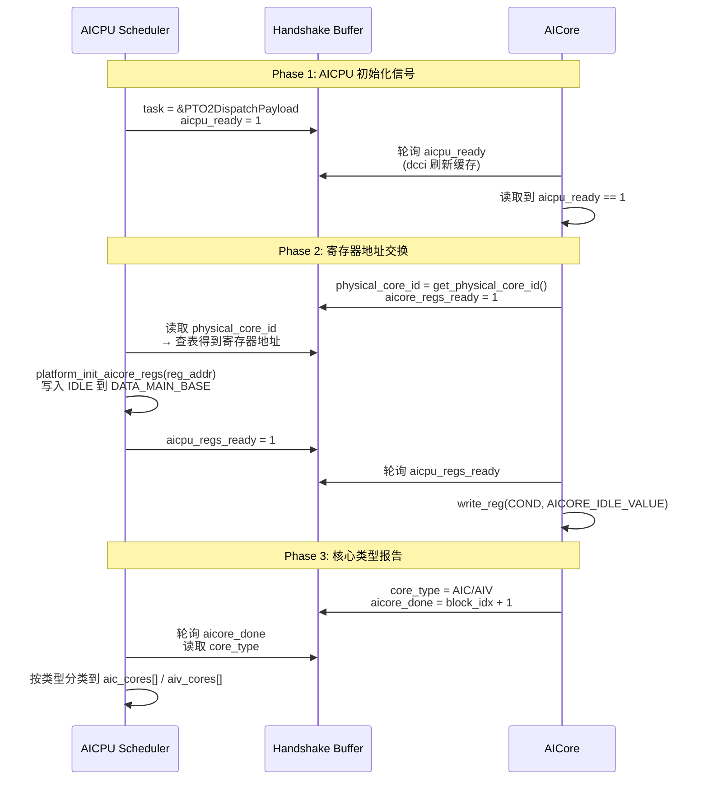
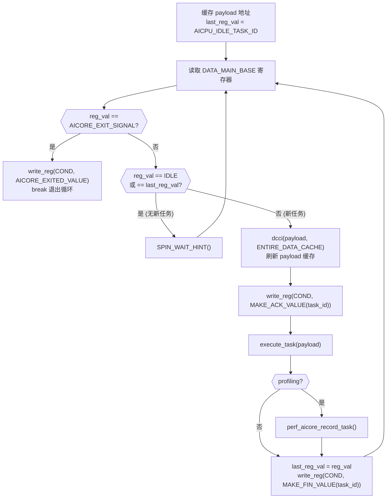
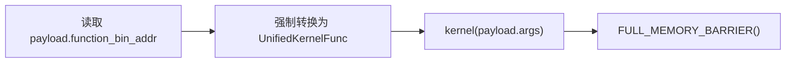
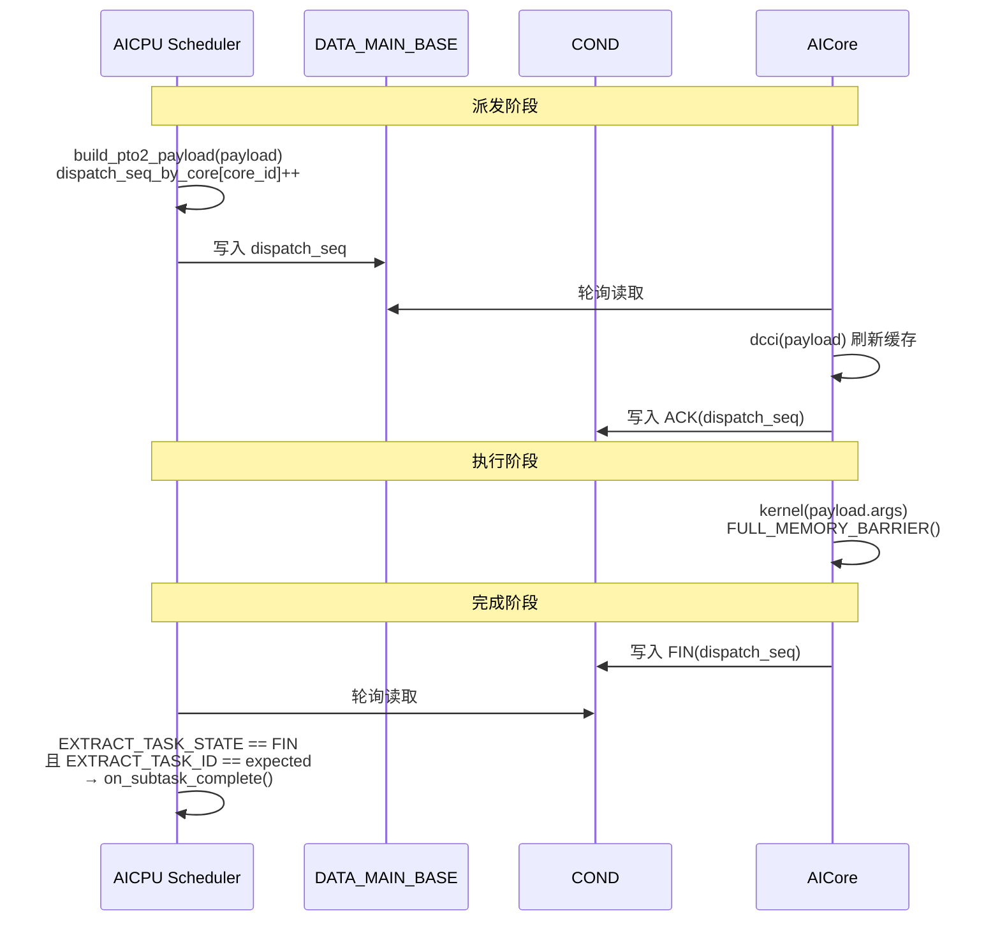
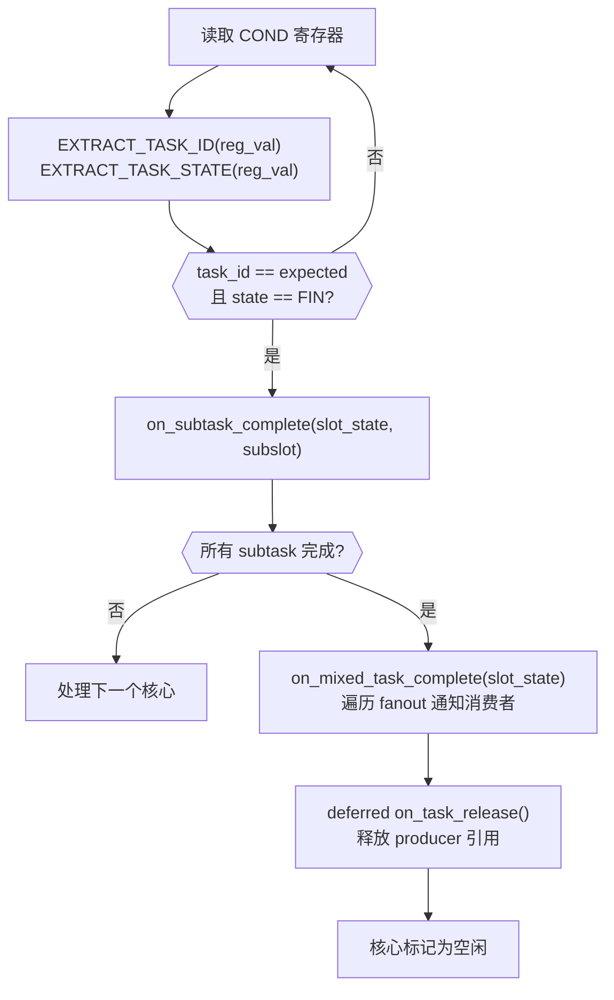
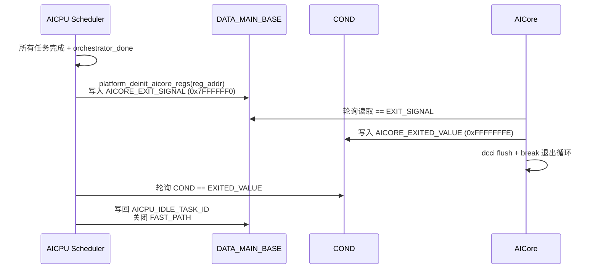

# AICore 处理流程

> AICore 的初始化握手、主循环、内核执行、寄存器通信协议与关闭流程。

## 1. AICore 角色与职责

AICore 是 Ascend NPU 的计算核心，负责执行内核函数。每个 block 包含 1 个 AIC（矩阵运算）+ 2 个 AIV（向量运算），共 24 blocks = 72 个核心。



**核心职责**：
1. 轮询 `DATA_MAIN_BASE` 寄存器接收任务派发
2. 从 `PTO2DispatchPayload` 读取内核地址和参数
3. 执行内核函数，读写 GM 中的 tensor 数据
4. 通过 `COND` 寄存器报告 ACK/FIN 状态

---

## 2. 初始化握手协议

AICore 启动后需与 AICPU 完成三阶段握手，建立寄存器通信通道。



### 2.1 Handshake 缓冲区

每个 AICore 有独立的 `Handshake` 缓冲区（64B cache line 对齐），存储在 `Runtime.workers[block_idx]` 中：

| 字段 | 方向 | 说明 |
|------|------|------|
| `aicpu_ready` | AICPU→AICore | 初始化就绪信号 |
| `task` | AICPU→AICore | `PTO2DispatchPayload*` 指针（初始化后固定不变） |
| `physical_core_id` | AICore→AICPU | 硬件物理核心 ID |
| `aicore_regs_ready` | AICore→AICPU | 物理 ID 已报告 |
| `aicpu_regs_ready` | AICPU→AICore | 寄存器初始化完成 |
| `core_type` | AICore→AICPU | `CoreType::AIC` 或 `CoreType::AIV` |
| `aicore_done` | AICore→AICPU | 就绪信号（`block_idx + 1`，非零表示就绪） |
| `perf_records_addr` | AICPU→AICore | 性能记录缓冲区地址 |

---

## 3. 主执行循环

握手完成后，AICore 进入轮询循环，通过 `DATA_MAIN_BASE` 寄存器接收任务。



### 3.1 寄存器值判断逻辑

| DATA_MAIN_BASE 值 | 含义 | AICore 行为 |
|---|---|---|
| `AICPU_IDLE_TASK_ID` (0x7FFFFFFD) | 空闲，无任务 | 继续轮询 |
| `== last_reg_val` | 重复值（未派发新任务） | 继续轮询 |
| `AICORE_EXIT_SIGNAL` (0x7FFFFFF0) | 关闭信号 | 写 EXITED 并退出 |
| 其他值 | `dispatch_seq`（新任务） | 执行任务 |

### 3.2 新任务检测机制

AICore 使用 `last_reg_val` 对比检测新任务到来。AICPU 每次派发时写入新的 `dispatch_seq`（per-core 单调递增），保证每次派发的寄存器值唯一。

---

## 4. 内核执行

```cpp
typedef void (*UnifiedKernelFunc)(__gm__ int64_t*);
```

所有内核遵循统一签名：`void kernel(__gm__ int64_t* args)`。

### 4.1 执行流程



1. 从 `PTO2DispatchPayload.function_bin_addr` 获取内核入口地址
2. 将 `payload.args` 作为参数调用内核（args 布局：tensor 指针在前，scalar 值在后）
3. 执行完整内存屏障，确保所有写操作对其他核心可见

### 4.2 PTO2DispatchPayload 结构

AICore 唯一需要读取的数据结构，由 AICPU 在派发时原地构建：

| 字段 | 类型 | 说明 |
|------|------|------|
| `function_bin_addr` | `uint64_t` | 内核函数在 GM 中的入口地址 |
| `args[128]` | `uint64_t[]` | 内核参数：前 N 个为 `Tensor*` 指针，后 M 个为 scalar 值 |

**设计要点**：Payload 只包含执行所需的最小信息。元数据（`mixed_task_id`、`kernel_id`、`core_type`）保留在 `PTO2TaskDescriptor` 中，由 AICPU 在需要时访问（如 profiling）。

---

## 5. 寄存器通信协议

### 5.1 寄存器定义

| 寄存器 | SPR 偏移 | 方向 | 位宽 | 用途 |
|--------|---------|------|------|------|
| `DATA_MAIN_BASE` | 0xA0 | AICPU→AICore | 32-bit | 任务派发（写入 `dispatch_seq`） |
| `COND` | 0x4C8 | AICore→AICPU | 32-bit | 状态报告（ACK/FIN + task_id） |

### 5.2 COND 寄存器编码

```
bit 31      bits 30..0
┌──────┬──────────────────┐
│ state│     task_id      │
└──────┴──────────────────┘
 0 = ACK  (任务已接收)
 1 = FIN  (任务已完成)
```

| 宏 | 值 | 含义 |
|----|---|------|
| `MAKE_ACK_VALUE(id)` | `id & 0x7FFFFFFF` | ACK：bit31=0 |
| `MAKE_FIN_VALUE(id)` | `id \| 0x80000000` | FIN：bit31=1 |
| `AICORE_IDLE_VALUE` | `0xFFFFFFFF` | FIN(0x7FFFFFFF)，初始空闲 |
| `AICORE_EXITED_VALUE` | `0xFFFFFFFE` | FIN(0x7FFFFFFE)，已退出 |

### 5.3 完整派发-完成时序



### 5.4 dispatch_seq 设计

AICPU 为每个核心维护独立的单调递增计数器 `dispatch_seq_by_core_[core_id]`：

```
dispatch_seq_by_core_[core_id]++
reg_task_id = dispatch_seq_by_core_[core_id] & TASK_ID_MASK

// 跳过保留哨兵范围 [0x7FFFFFF0, 0x7FFFFFFF]
if (reg_task_id >= AICORE_EXIT_SIGNAL) {
    dispatch_seq_by_core_[core_id] += (TASK_ID_MASK - reg_task_id + 1);
}
```

**设计原因**：`mixed_task_id` 是 64 位（`ring_id << 32 | local_id`），截断为 32 位会丢失 `ring_id`，导致不同 ring 的相同 `local_id` 产生碰撞。per-core 单调递增的 `dispatch_seq` 保证每次派发值唯一。

---

## 6. AICPU 侧派发与完成处理

### 6.1 Payload 构建（AICPU 侧）

AICPU 在每次派发前原地更新 per-core 的 `PTO2DispatchPayload`：


1. `get_function_bin_addr(kernel_id)` → 查 `func_id_to_addr_[]` 表
2. 按顺序写入 args：先写 `&task_payload.tensors[i]`（Tensor 指针），再写 `task_payload.scalars[i]`（scalar 值）
3. 对 tensor 调用 `update_start_offset()` 更新偏移
4. 写入 `dispatch_seq` 到 `DATA_MAIN_BASE` 寄存器触发执行

### 6.2 完成轮询（AICPU 侧）



AICPU 使用**延迟释放（deferred release）**策略：将已完成任务的 `slot_state` 暂存到数组（最多 256 个），批量执行 `on_task_release()`，减少冷路径开销。

---

## 7. 关闭流程



---

## 8. 缓存一致性

AICore 和 AICPU 通过 GM 共享数据，需要显式缓存管理：

| 操作 | 调用 | 时机 |
|------|------|------|
| 刷新 Handshake 到 GM | `dcci(hank, CACHELINE_OUT)` | 写 Handshake 字段后 |
| 从 GM 读取 Handshake | `dcci(hank, SINGLE_CACHE_LINE)` | 轮询 Handshake 字段时 |
| 刷新 Payload 缓存 | `dcci(payload, ENTIRE_DATA_CACHE)` | 执行内核前 |
| 内核执行后屏障 | `FULL_MEMORY_BARRIER()` | 内核返回后、写 FIN 前 |

---

> 系统总体架构详见 [01-数据流与核心设计.md](01-数据流与核心设计.md)，Scheduler 侧的完成处理和调度流程详见 [03-Scheduler处理流程.md](03-Scheduler处理流程.md)。
